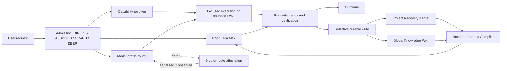

# Pixel Second Brain and Codex Workflow

Status: blueprint v1 complete; M0 Contract Freeze and Local Scaffold, M1
Authority Storage Core, M2 Project Recovery Kernel v2, M3 Global Knowledge Wiki
and Ingest, M4 Federated Retrieval and Bounded Context, M5 Admission,
Permissions, and Capability Resolver, M6 Model Registry and 9router
Attestation, and M7 Bounded Work-Graph Runtime are complete locally. M8
Integrated Evaluation and Local Canary is in progress: its local component
evidence is verified, including redacted ten-case M4 and controlled M7
performance/context-proxy fixtures. Its release remains blocked pending
M9-gated semantic, provider-task performance, production-scale M4, live-route,
and global rollback evidence. Its local B3 rollback evidence is bound to the
evaluated baseline and a post-restore synthetic canary. M9's official global
rollback path now also requires a freshly generated exact rollback packet and a
new user approval; the historical deployed standalone helper is not a new
approval. M9 has a redacted,
exact pre-approval packet and transactional rollout tooling. The approved
additive M9 guidance/skill and rollback backup are applied, and an initial
50-request `PUBLIC` read-only shadow completed 50/50 without tool activity or
mutation. Codex CLI did not provide authenticated route telemetry, so the
rollout remains shadow-only and is not eligible for opt-in or promotion.
The source-bound [M8/M9 readiness checkpoint](artifacts/m8-m9-readiness-v2.json)
reconciles those two facts without treating a successful response as route
attestation. The prior `m8-m9-readiness.json` remains immutable historical
evidence for its earlier M8 receipt tree.

A separate Practical V1 bridge is now installed globally from its exact approved
packet and passed a local disposable canary. It provides explicit health,
targeted project recovery, global knowledge reads, and pending-review proposal
writes while keeping `DIRECT` zero-memory by default. Its operator-trusted
9router log contract proves only what the trusted router reports/sends, not
provider internals. Strict M8/M9 signed upstream attestation remains open. See
[the Practical V1 document](docs/23-PRACTICAL-V1-BRIDGE-AND-ROUTER-EVIDENCE.md).

[Activation V2](docs/24-ACTIVATION-V2-AUTOMATIC-MEMORY-GRAPH-AND-ROUTING.md)
is the detailed design for a later opt-in automatic-memory, typed graph, and
front-door routing expansion. It is a design contract only; it does not enable
stores, hooks, automatic writes, root-model switching, or any new global target.
Its A0-A8 checkpoints are fixture-only local evidence; the latest reviewed
promotion and restore evaluator is documented in
[the A8 checkpoint](docs/33-ACTIVATION-V2-A8-SYNTHETIC-REVIEWED-PROMOTION.md).
It does not create a global object, inspect a real target, or consume approval.

This repository defines an implementation-ready design for a personal second
brain and an efficient global Codex workflow. The target behavior is simple:
routine questions stay fast, difficult work receives proportional depth, and
durable knowledge survives session boundaries without loading an entire vault.

## Intended Outcome

- Tera Max remains the default root chat and owns intent, integration, and the
  final answer.
- Simple prompts use `DIRECT`: no automatic research, global memory lookup,
  plugin/MCP activation, or agent fan-out.
- Complex work uses a bounded dependency graph only when independent branches,
  dependency structure, or independent review justify the overhead.
- Installed skills, plugins, apps, and MCPs are selected from task intent. The
  user does not need to remember capability names.
- Project recovery and global knowledge remain separate durable authorities.
- Retrieval compiles a small evidence packet with provenance, freshness,
  contradictions, and omissions instead of injecting a whole vault.
- Exactly seven approved model profiles are routed through a versioned registry
  and checked end to end against correlated synthetic telemetry fixtures; live
  9router attestation remains a later deployment-gated concern.
- Global configuration changes are staged, tested, reviewable, and reversible;
  none are implicit.

## System Shape



## Two Durable Domains

| Domain | Stores | Does not store |
| --- | --- | --- |
| Project Recovery Kernel | Active objective, decisions, tasks, blockers, bugs, experiments, code-linked evidence, recovery receipts | General encyclopedia, whole transcripts, global recommendations |
| Global Knowledge Wiki | Immutable raw captures plus source, entity, concept, claim, and synthesis pages | Project task state, unreviewed handoffs, executable instructions |

The two stores may reference each other through qualified IDs. Project evidence
is never promoted to global knowledge automatically.

## Execution Lanes

| Lane | Default behavior | Hard guardrail |
| --- | --- | --- |
| `DIRECT` | Root answers or performs a self-contained low-risk task | No external research, global retrieval, or graph without a concrete escalation reason |
| `ASSISTED` | Root uses a small number of local tools or one bounded lookup | No child agent; capability set remains minimal |
| `GRAPH` | Root validates and runs a bounded DAG | Maximum 12 nodes, 4 concurrent workers, depth 1, one writer per scope, integrator required |
| `DEEP` | Root applies high-risk, security, rollback, and review gates | A graph is used only when graph admission also passes |

## Approved Model Profiles

| Profile | Primary role |
| --- | --- |
| Tera Max | Root orchestration, architecture, conflict resolution, integration |
| Tera xhigh | Analysis, research synthesis, dependency work, medium diagnosis |
| Tera high | Fast read-heavy scan, explanation, log triage, routine reasoning |
| Sol Max | Difficult multi-file implementation, deep debugging, complex tool use |
| Sol xhigh | Scoped frontend/backend implementation, refactor, tests, polish |
| Luna xhigh | Finite, mechanical, non-sensitive work with deterministic verification |
| GPT-5.5 xhigh | Independent security, compatibility, adversarial, and test-gap review |

`DIRECT` stays in the root session even when another profile looks cheaper. No
agent is spawned solely to switch models. Raw model slugs and effort serialization
belong only in the versioned adapter registry and must be validated against the
installed Codex and 9router versions.

## Canonical Memory Terms

Machine-readable axes remain separate:

- lifecycle: `active`, `superseded`, `archived`, `deleted`;
- freshness: `fresh`, `partial`, `stale`, `unverifiable`, `not_applicable`;
- verification: `unverified`, `verified`, `partial`, `stale`, `failed`,
  `not_applicable`;
- epistemic: `asserted`, `corroborated`, `disputed`, `refuted`, `unknown`,
  `not_applicable`.

The UI may derive `current`, `partially_stale`, `historical`, or `invalid`, but
those labels do not replace the underlying axes. A relevant partial or historical
record is surfaced with a warning rather than silently removed.

## Capability Strategy

Capability resolution uses progressive disclosure:

1. repository/global instructions already in scope;
2. matching installed skill;
3. installed plugin capability or local implementation;
4. configured MCP/app when live external data or action is required;
5. vetted external discovery only when a real capability gap remains.

The intended gateway set is small: orchestration, research, backend, frontend,
security, and memory. Each gateway loads narrow references or scripts only after
selection. Third-party code is never trusted merely because its author is famous;
license, provenance, executable behavior, network access, permissions, pinned
version, evaluation evidence, and rollback must all be reviewed.

## Document Map

| Document | Purpose |
| --- | --- |
| [Vision and principles](docs/00-VISION-AND-PRINCIPLES.md) | Product philosophy, invariants, and trade-off order |
| [PRD](docs/01-PRD.md) | Personas, requirements, metrics, non-goals, and release acceptance |
| [System architecture](docs/02-SYSTEM-ARCHITECTURE.md) | Components, authority boundaries, storage topology, and failure behavior |
| [Memory architecture](docs/03-MEMORY-ARCHITECTURE.md) | Object model, source quarantine, retrieval, context compilation, and migration |
| [Workflow orchestration](docs/04-WORKFLOW-ORCHESTRATION.md) | Admission, anti-spiral rules, graph contract, budgets, and lifecycle |
| [Model routing](docs/05-MODEL-ROUTING.md) | Seven profiles, selection policy, 9router attestation, and canary protocol |
| [Data schemas](docs/06-DATA-SCHEMAS.md) | Normative object, event, receipt, index, query, and context schemas |
| [Security and privacy](docs/07-SECURITY-AND-PRIVACY.md) | Authority, data classes, permission, supply chain, and incident response |
| [Evaluation plan](docs/08-EVALUATION-AND-TEST-PLAN.md) | Baselines, datasets, non-inferiority gates, rollout, and rollback |
| [Implementation roadmap](docs/09-IMPLEMENTATION-ROADMAP.md) | Dependency graph, milestones, artifacts, tests, and global approval gate |
| [Operations and lifecycle](docs/10-OPERATIONS-AND-LIFECYCLE.md) | Runtime, maintenance, recovery, degraded modes, migration, and incidents |
| [New-session prompt](docs/11-NEW-SESSION-PROMPT.md) | Exact bootstrap prompt for the first implementation session |
| [M0 local scaffold](docs/12-M0-LOCAL-SCAFFOLD.md) | Directory ownership, local commands, and M0 contract boundary |
| [M1 authoritative storage core](docs/13-M1-AUTHORITATIVE-STORAGE-CORE.md) | Local storage kernel, acceptance evidence, and rollback boundary |
| [M2 project recovery kernel](docs/14-M2-PROJECT-RECOVERY-KERNEL.md) | Local recovery, freshness, and bounded handoff evidence |
| [M3 global knowledge wiki](docs/15-M3-GLOBAL-KNOWLEDGE-WIKI.md) | Local raw capture, semantic compilation, and derived navigation evidence |
| [M4 federated retrieval](docs/16-M4-FEDERATED-RETRIEVAL.md) | Local federation, bounded context, provenance, and retrieval fallback evidence |
| [M5 admission and capabilities](docs/17-M5-ADMISSION-AND-CAPABILITIES.md) | Local admission, permission, capability, and supply-chain policy evidence |
| [M6 model registry and route attestation](docs/18-M6-MODEL-REGISTRY-AND-ROUTE-ATTESTATION.md) | Local registry, routing, synthetic canary, staging, rollback, and denial boundary evidence |
| [M7 bounded work-graph runtime](docs/19-M7-BOUNDED-WORK-GRAPH-RUNTIME.md) | Local bounded DAG validation, scheduling, cancellation, proposal-only results, and review evidence |
| [M8 integrated evaluation](docs/20-M8-INTEGRATED-EVALUATION-LOCAL-CANARY.md) | Local component evidence, typed receipts, offline canary, and B3-bound rollback rehearsal |
| [M9 global approval and rollout](docs/21-M9-EXACT-GLOBAL-APPROVAL-AND-ROLLOUT.md) | Exact global packet, additive staged skill/guidance, anti-drift preflight, backup, and rollback boundary |
| [M8/M9 external-evidence runbook](docs/22-M8-M9-EXTERNAL-EVIDENCE-RUNBOOK.md) | Redacted trust-anchor, route-attestation, and blinded-review preparation for future approved evidence stages |
| [Practical V1 bridge and router evidence](docs/23-PRACTICAL-V1-BRIDGE-AND-ROUTER-EVIDENCE.md) | Operator-trusted outbound evidence, installed bounded runtime bridge, canary, and rollback boundary |
| [Activation V2 blueprint](docs/24-ACTIVATION-V2-AUTOMATIC-MEMORY-GRAPH-AND-ROUTING.md) | Opt-in automatic memory, typed project/global graph, visualization, lifecycle integration, front-door routing, and rollout contract |
| [ADRs](docs/adr/) | Accepted architectural decisions that changes must preserve |

Repository implementation guidance is in [AGENTS.md](AGENTS.md).

`planning/work-graph.json` is a historical execution record for producing this
blueprint. Its `profile` fields use the currently installed orchestrator runtime
namespace so that the existing validator can verify the record; `logical_profile`
contains the canonical seven-profile alias. It is not an implementation graph
template.

## Quality Bar

The implementation is not promoted unless evidence demonstrates all of the
following:

- at least 95% of eligible simple prompts remain `DIRECT`;
- no simple stable prompt starts web/MCP/GitHub research automatically;
- no safety-critical regression and no more than the allowed aggregate quality
  delta against the Tera Max baseline;
- 100% canonical project-recovery recall and zero silent stale omission;
- 100% provenance coverage for material external claims;
- zero cross-project leakage, secret persistence, unauthorized global mutation,
  or route mismatch on promoted traffic;
- deterministic rebuild equivalence after deleting derived indexes;
- full seven-profile 9router canary after every relevant router/Codex update.

## Current Boundary

This repository contains the blueprint plus completed M0-M7 local milestones.
M6 adds the active V2 seven-profile registry, explicit local TOML staging,
immutable route intent/serialization/telemetry reconciliation, redacted
synthetic receipts, a seven-profile canary, and contained local rollback on top
of the M1-M5 authority and policy surfaces. M7 adds a project-local bounded DAG
validator and synthetic scheduler with typed, proposal-only output; it binds
graph entry to M5 admission, retains M6 as a denial-only route boundary, and
does not execute a material action. Its mapping, canary, and graph-run evidence
are synthetic-local; none can authorize a live side effect. M9 adds a
project-local packet builder which emits only allowlisted metadata and digests
from a declared Codex home. It transiently derives an append and backup hash
without persisting global guidance/configuration contents in this repository.
It stages one additive global guidance block and one skill, guards their later
application with a current packet digest, before-state backup, exclusive lock,
after-digest checks, and an exact rollback that is separately bound to a fresh
rollback packet and approval. It does not write a global target until a fresh
explicit user approval exists. The first approved packet has now
been applied exactly, with its 50-request shadow receipt retained in
`artifacts/m9-initial-shadow-report.json`; it is still not authenticated route
evidence or a promoted global workflow. The already-deployed backup helper is a
historical recovery artifact, not authorization to bypass the current rollback
gate.

M8 adds eight source-bound, CAS-protected local receipts. Its M4 fixture runs
redacted retrieval/context checks for ten fixed memory cases, and its controlled
M7 fixture records three paired monotonic schedules plus an aggregate context
proxy. Both are explicitly local evidence and do not satisfy the provider-task,
production-scale, or live promotion gates.

For the next live-evidence stage, `second_brain.m9_external_evidence` defines
fail-closed route-attestation and blinded-review intake types. It requires a
separately trusted detached-proof verifier, redacts all raw external values from
its receipts, and always denies promotion/material authority. It does not
retroactively attest the current 50-request shadow or authorize a next rollout.
The project-local OpenSSH adapter and preparation/verifier scripts in
`scripts/prepare_m9_external_trust_policy.py`,
`scripts/prepare_m9_route_approval_intent.py`,
`scripts/prepare_m9_route_attestation_plan.py`,
`scripts/prepare_m9_route_approval_packet.py`,
`scripts/preflight_m9_route_approval.py`,
`scripts/prepare_m9_blinded_review_plan.py`, and
`scripts/verify_m9_external_evidence.py` make the future manual evidence step
reproducible without retaining raw telemetry or a private key.

The implementation has not:

- modified global agents, plugins, MCPs, hooks, endpoint configuration, or
  provider settings. The approved M9 packet made only its five listed changes:
  a marker-bounded global guidance append, one global skill, and three backup
  / rollback files;
- read, imported, or modified the old Obsidian vault;
- modified `/home/pixel/Data/PROJECT/ai-memory`;
- installed third-party packages, changed endpoint configuration, or enabled
  automatic memory access for `DIRECT`.

The exact Practical V1 packet was explicitly approved and applied to its seven
listed targets only: the existing global workflow skill, its source-bound local
bridge wrapper, and the `practical-v1-v1` backup/rollback tree. The redacted
[apply report](artifacts/practical-v1-apply-report.json) records exact target
readback and a no-network disposable canary. Global `AGENTS.md`, config, agents,
providers, plugins, MCPs, hooks, 9router, Obsidian, and `ai-memory` remain out
of scope.

## Verification And M9 Operation

Run the repository contract, documentation, lint, and test suite:

```bash
make check
PYTHONDONTWRITEBYTECODE=1 PYTHONPATH=src python3 scripts/check_clean_room.py
```

Verify the local Practical V1 router fixture and inspect its source binding:

```bash
PYTHONDONTWRITEBYTECODE=1 PYTHONPATH=src python3 scripts/practical_v1_bridge.py \
  verify-router-log --evidence-root "$(pwd -P)/fixtures/practical-v1" \
  --plan router-plan.json --log router-outbound.jsonl
PYTHONDONTWRITEBYTECODE=1 PYTHONPATH=src python3 scripts/practical_v1_bridge.py \
  source-binding
```

The M8 CLI deliberately exits `2` when local evidence is valid but promotion is
blocked for M9 evidence. That is a safe checkpoint, not a passing global
release:

```bash
PYTHONDONTWRITEBYTECODE=1 PYTHONPATH=src python3 scripts/run_m8_evaluation.py
```

M9 uses explicit commands rather than an implicit installer. Creating or
preflighting a packet is read-only against the global Codex home; applying it is
blocked in code until the user has approved the exact current packet digest:

```bash
PYTHONDONTWRITEBYTECODE=1 PYTHONPATH=src python3 \
  scripts/prepare_m9_approval_packet.py --codex-home /home/pixel/.codex
PYTHONDONTWRITEBYTECODE=1 PYTHONPATH=src python3 \
  scripts/run_m9_rollout.py --codex-home /home/pixel/.codex preflight
```

The current packet has already been applied, so do not rerun its preflight or
apply command. Verify the immutable, redacted initial-shadow receipt without a
provider request instead:

```bash
PYTHONDONTWRITEBYTECODE=1 PYTHONPATH=src python3 \
  scripts/verify_m9_initial_shadow.py
```

Global rollback is a separate mutation and has no current approval. If it is
needed later, first generate a fresh, redacted rollback packet against the exact
current applied state, obtain approval for that new digest, then use the
official runner. The historical helper under the deployed backup is not an
approval substitute and must not be edited or run as this path:

```bash
PYTHONDONTWRITEBYTECODE=1 PYTHONPATH=src python3 \
  scripts/prepare_m9_rollback_approval_packet.py \
  --codex-home /home/pixel/.codex
PYTHONDONTWRITEBYTECODE=1 PYTHONPATH=src python3 \
  scripts/run_m9_rollout.py --codex-home /home/pixel/.codex rollback \
  --rollback-approval-packet artifacts/m9-rollback-approval-packet.json \
  --approval-reference '<fresh explicit approval containing rollback packet digest>'
```

See [the M9 rollout document](docs/21-M9-EXACT-GLOBAL-APPROVAL-AND-ROLLOUT.md)
before requesting any opt-in, expanded rollout, default activation, or soak.
