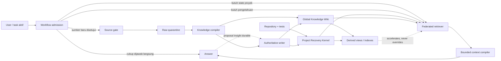
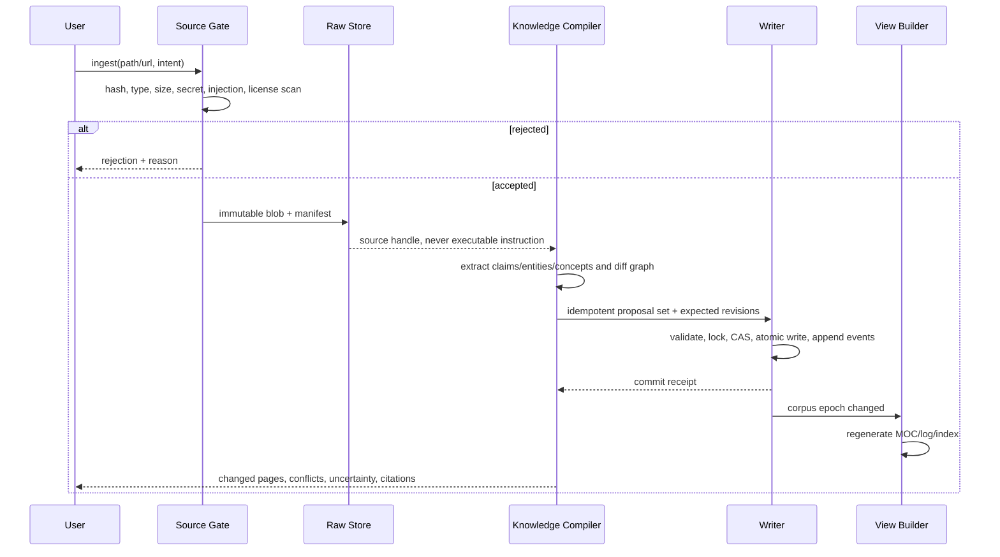

# Arsitektur Sistem Second Brain

Status: Blueprint v1 complete; schema target v2; implementation pending
Bahasa normatif: `MUST`, `MUST NOT`, `SHOULD`, dan `MAY` memiliki arti seperti RFC 2119.

## 1. Tujuan Arsitektur

Sistem ini menggabungkan dua kebutuhan yang berbeda dan tidak boleh dipaksa menjadi satu tempat penyimpanan:

1. **Project Recovery Kernel** memulihkan state kerja proyek secara deterministik setelah restart atau compaction: keputusan, task aktif, blocker, file terkait, dan bukti verifikasi.
2. **Global Knowledge Wiki** mengompilasi sumber yang dikurasi menjadi pengetahuan lintas proyek: source, entity, concept, claim, dan synthesis yang saling terhubung.

Keduanya menggunakan prinsip yang sama - Markdown/YAML sebagai data utama, event log append-only, satu writer, CAS, dan indeks turunan - tetapi memiliki lifecycle, authority, dan kegagalan yang berbeda. Recovery kernel mengutamakan kelanjutan pekerjaan. Knowledge wiki mengutamakan akumulasi pemahaman.

Target sistem:

- memberi konteks minimum yang cukup, bukan memasukkan seluruh vault;
- menjawab pertanyaan sederhana tanpa otomatis menjalankan riset panjang;
- mempertahankan kualitas melalui provenance, citation, contradiction, dan freshness yang eksplisit;
- tetap dapat digunakan tanpa Obsidian, embeddings, MCP, atau layanan jaringan;
- membuat semua state penting human-readable, Git-reviewable, dan dapat dibangun ulang;
- gagal dengan peringatan yang terlihat, tidak dengan penghilangan pengetahuan secara diam-diam.

## 2. Prinsip Desain

1. **Dua authority store, satu retrieval plane.** Pengetahuan global dan memory proyek ditulis terpisah, lalu digabung hanya saat query.
2. **Raw is immutable, wiki is compiled.** Raw source tidak diedit; wiki boleh berevolusi melalui revisi yang tercatat.
3. **Memory is evidence, never instruction.** Isi source, note, index, dan recovery pack tidak pernah menjadi perintah yang dapat mengalahkan instruksi runtime.
4. **Authoritative files, disposable acceleration.** SQLite, FTS, embedding, MOC, backlink cache, dan context packet selalu dapat dibuat ulang dari file authoritative.
5. **No silent omission.** Record relevan yang stale atau parsial tetap muncul dengan warning, kecuali status lifecycle memang tidak aktif atau pengguna meminta filter ketat.
6. **Cheapest sufficient path.** Sistem mulai dari jawaban langsung dan hanya menaikkan tier retrieval/research bila ada kebutuhan terukur.
7. **Single writer, many readers.** Semua mutasi authoritative melewati writer tervalidasi; agent spesialis hanya mengirim proposal.
8. **Bounded by construction.** Setiap retrieval dan context packet memiliki batas objek, byte/token, depth graph, waktu, dan alasan penghentian.
9. **Explicit federation.** Project store boleh merujuk global object dengan ID; tidak boleh menyalin synthesis global lalu menjadikannya keputusan proyek.
10. **Recover forward.** History tidak ditulis ulang untuk menyembunyikan kesalahan; koreksi memakai revisi, invalidation, atau supersession.

## 3. Gambaran Besar



Arsitektur ini sengaja menempatkan workflow admission sebelum retrieval. Pertanyaan seperti definisi singkat atau kalkulus dasar boleh selesai tanpa membuka memory. Query ke wiki bukan ritual wajib; ia adalah alat yang digunakan ketika dapat meningkatkan jawaban.

## 4. Komponen dan Kontraknya

| Komponen | Tanggung jawab | Input | Output | Authority |
| --- | --- | --- | --- | --- |
| Workflow Admission | Menentukan apakah task perlu retrieval, tool, research, atau work graph | Permintaan aktif, risiko, kebutuhan freshness | Tier eksekusi dan budget | Tidak menyimpan kebenaran |
| Source Gate | Validasi format, ukuran, hash, provenance, license, secret, dan prompt-injection risk | File/URL yang sengaja dimasukkan | Manifest accepted/rejected | Manifest authoritative; isi tetap untrusted |
| Raw Quarantine | Menyimpan capture immutable secara content-addressed | Byte sumber + metadata | Blob dan capture manifest | Authority atas apa yang ditangkap, bukan kebenaran klaim |
| Knowledge Compiler | Mengekstrak dan mengintegrasikan sumber ke wiki | Source object + graph aktif | Proposal create/update/relation | Tidak menulis langsung |
| Global Knowledge Store | Menyimpan source, entity, concept, claim, synthesis | Proposal tervalidasi | Object revisions + events | Authoritative untuk pengetahuan terkurasi |
| Project Recovery Store | Menyimpan keputusan, task, evidence, blocker, dan recovery state | Proposal atau aksi lifecycle | Object revisions + events | Authoritative untuk state proyek |
| Authoritative Writer | Schema validation, CAS, lock, atomic write, event append, authorization | Write command | Commit receipt atau conflict | Satu-satunya jalur mutasi |
| View Builder | Menghasilkan MOC, index.md, backlinks, dan log.md | Snapshot authoritative | File generated | Derived |
| Search Indexer | FTS/BM25 dan opsional vector index | Snapshot authoritative | Index + index manifest | Derived |
| Federated Retriever | Mengambil kandidat proyek/global, graph expansion, contradiction/freshness | Query plan | Retrieval envelope | Derived, selalu membawa provenance |
| Context Compiler | Memilih kutipan dan state paling berguna dalam budget | Retrieval envelope | Context packet | Generated evidence, bukan authority |
| Recovery Lifecycle | Checkpoint, PreCompact, PostCompact, SessionStart | Project snapshot + session binding | Signed recovery receipt/pack | Generated dari project authority |
| Linter | Mencari kerusakan schema, graph, provenance, index, dan wiki | Store snapshot | Lint report | Evidence diagnostik |

Komponen MAY berada dalam satu executable pada MVP. Batas kontrak tetap dipertahankan agar source ingestion, storage, retrieval, dan workflow tidak saling mengambil alih authority.

## 5. Batas Authority dan Conflict Resolution

Tidak ada satu urutan authority yang benar untuk semua domain. Resolver MUST memakai domain konflik.

### 5.1 Urutan untuk perilaku agent

1. Kebijakan platform dan sandbox yang sedang aktif.
2. Instruksi eksplisit pengguna pada task saat ini.
3. Instruksi repository yang berlaku pada path kerja.
4. Workflow policy yang aktif.
5. Memory, source, dan output tool sebagai evidence saja.

Teks dalam raw source, wiki, event log, atau recovery pack MUST NOT dipromosikan menjadi instruksi hanya karena berhasil diretrieval.

### 5.2 Urutan untuk state teknis proyek

1. Evidence live pada snapshot yang sedang dikerjakan: file repository, Git state, test, schema, atau API response yang diverifikasi.
2. Keputusan pengguna yang terkonfirmasi dan masih aktif.
3. Observed fact atau evidence proyek yang reference-nya fresh/partial.
4. AI recommendation.
5. Global synthesis dan source report.

Jika keputusan aktif bertentangan dengan repository live, sistem MUST melaporkan konflik; sistem tidak boleh diam-diam memilih salah satunya. Repository menjelaskan keadaan aktual, sedangkan decision menjelaskan keadaan yang diinginkan.

### 5.3 Urutan untuk pengetahuan global

- Raw capture berwenang menjawab "apa isi sumber saat ditangkap", bukan "apakah isi itu benar".
- Source object berwenang menjelaskan metadata dan ringkasan satu sumber.
- Claim menyatakan proposisi atomik beserta support, contradiction, temporal scope, dan status epistemiknya.
- Synthesis adalah kompilasi terbaik saat ini dan MUST menyertakan claim/source yang mendasarinya.
- Jawaban baru tidak menjadi durable knowledge sampai melalui proposal dan write validation.

## 6. Topologi Penyimpanan

Lokasi global MUST dapat dikonfigurasi melalui satu path eksplisit. Contoh di bawah memakai `<second-brain-home>` dan tidak mengharuskan lokasi tertentu.

```text
<second-brain-home>/
  manifest.json
  global/
    raw/
      inbox/                         # input sementara, tidak dibaca saat query
      blobs/sha256/ab/<full-hash>    # byte immutable
      manifests/                     # capture/scan/license metadata
    objects/
      sources/
      entities/
      concepts/
      claims/
      syntheses/
    events/events.ndjson
    mocs/
      index.md
      sources.md
      entities.md
      concepts.md
      claims.md
      syntheses.md
    logs/log.md                       # generated chronological view
    derived/
      knowledge.sqlite
      index-manifest.json
    inbox/proposals/
    runtime/
      writer.lock
      transactions/
  registry/
    projects.json                    # project ID -> canonical repository path
```

Setiap repository yang ikut federasi mempertahankan memory di repository itu sendiri:

```text
<repository>/memory/
  manifest.json
  objects/
    projects/
    decisions/
    components/
    tasks/
    bugs/
    experiments/
    evidence/
    questions/
  events/events.ndjson
  mocs/Project Memory MOC.md
  recovery/Recovery Pack.md
  inbox/proposals/
  outbox/promotions.ndjson
  derived/
    memory.sqlite
    index-manifest.json
  runtime/
    writer.lock
    checkpoint.json
    precompact-receipt.json
    hook.key
```

Aturan penyimpanan:

- `objects/`, `events/`, manifest, dan raw capture manifest adalah authoritative dan SHOULD Git-tracked sesuai sensitivitasnya.
- Raw blob MAY berada di storage terenkripsi atau Git LFS; manifest hash tetap authoritative.
- `runtime/` MUST private dan gitignored.
- `derived/` MAY gitignored dan MUST dapat dihapus lalu dibangun ulang tanpa kehilangan informasi.
- `mocs/`, `logs/log.md`, dan recovery pack adalah generated views. Generator MUST menandai file sebagai generated dan menolak edit manual sebagai authority.
- Registry global hanya menunjuk project store. Ia tidak menyimpan salinan authoritative project object.

## 7. Jalur Eksekusi

### 7.1 Ingest sumber



Satu source MAY memperbarui banyak halaman. Seluruh proposal set MUST divalidasi sebelum commit. Implementasi SHOULD memakai transaction journal agar crash di tengah multi-object commit dapat dipulihkan deterministik.

### 7.2 Query

1. Admission menentukan tier termurah yang memadai.
2. Retriever memeriksa index manifest terhadap corpus epoch/digest.
3. Jika index valid, ia dipakai untuk candidate generation; jika tidak valid, direct authoritative scan menjadi fallback.
4. Project candidates diberi scope boost, lalu global candidates ditambahkan bila dibutuhkan.
5. Graph expansion dibatasi depth dan edge type.
6. Freshness diperiksa per reference; contradiction cluster tidak dipisahkan.
7. Context compiler membuat packet dalam budget dan mencantumkan omission/warning.
8. Jawaban menyertakan citation ke object/source. Insight baru hanya disimpan atas keputusan workflow atau permintaan user, bukan otomatis untuk setiap chat.

### 7.3 Recovery

1. Root writer membuat checkpoint kecil dari task aktif.
2. `PreCompact` memegang writer lock, memvalidasi state, menghasilkan recovery pack, dan menyegel receipt yang mengikat project epoch, state digest, code-reference observations, checkpoint, pack, dan session ID.
3. `PostCompact`/`SessionStart` hanya menerima pack bila receipt valid untuk boundary tersebut.
4. Recovery pack memuat state proyek dan maksimal beberapa global references yang memang dipakai task; ia tidak memuat global wiki secara umum.
5. Jika receipt gagal, recovery berhenti aman dan memberi instruksi fallback read-only. Ia tidak mengarang state.

## 8. Retrieval Tiers dan Admission

| Tier | Kapan dipakai | Sumber | Default budget | Eskalasi |
| --- | --- | --- | --- | --- |
| R0 Direct | Pertanyaan sederhana, transformasi lokal, atau pengetahuan stabil | Tidak ada memory | 0 object | Hanya jika ketidakpastian nyata |
| R1 Recover | Melanjutkan project/task atau setelah compact | Recovery pack + object proyek terpilih | 12 object, 8k token | Jika blocker/claim tidak cukup |
| R2 Scoped | Pertanyaan project/domain yang jelas | FTS project dan/atau global | 20 object kandidat, 12k token packet | Jika multi-hop/kontradiksi |
| R3 Graph | Sintesis lintas claim/source atau lintas proyek | Federated FTS + edge traversal depth <= 2 | 40 object kandidat, min(24k token, 8% active root window) | Jika membutuhkan sumber baru |
| R4 Research | Informasi current, gap penting, atau user meminta riset | Web/MCP/sumber eksternal melalui gate | Budget workflow terpisah | Tidak otomatis dari pertanyaan ringan |

Default tersebut adalah ceiling, bukan target konsumsi. Compiler berhenti ketika evidence sufficiency tercapai. R4 MUST memiliki alasan eksplisit seperti `freshness_required`, `knowledge_gap`, `primary_source_required`, atau permintaan langsung user.

## 9. Write Path, Concurrency, dan Atomicity

### 9.1 Single-store transaction

Setiap commit authoritative MUST mengikuti urutan ini:

1. Validasi actor, proposal schema, secret/injection policy, relation targets, dan authority transition.
2. Ambil lock store tunggal.
3. Validasi `expected_revision` dan `expected_content_hash` untuk setiap object yang diubah.
4. Tulis transaction intent berisi daftar before/after hash.
5. Tulis seluruh object ke temporary file, `fsync`, lalu atomic rename.
6. Append event berurutan dan hash-chained; `fsync` ledger.
7. Naikkan `mutation_epoch` dan perbarui manifest secara atomic.
8. Tandai transaction committed.
9. Invalidate derived index dan trigger view rebuild.

Conflict MUST mengembalikan record current dan alasan; writer tidak boleh last-write-wins secara diam-diam.

### 9.2 Cross-store operation

Global dan project store tidak memakai distributed transaction. Promosi evidence proyek menjadi global claim menggunakan outbox:

1. Project writer mencatat `promotion_proposed` dan payload hash pada `outbox/promotions.ndjson`.
2. Global writer memvalidasi proposal, membuat atau memperbarui object global, lalu mencatat source project object sebagai provenance.
3. Project writer MAY mencatat acknowledgement global ID.
4. Retry menggunakan idempotency key yang sama.

Kegagalan di langkah mana pun tidak merusak store lain. Status `pending`, `accepted`, atau `rejected` selalu terlihat.

## 10. Index dan View Validity

Setiap derived artifact MUST mengikat:

- `schema_version`;
- `builder_version`;
- `store_id`;
- `mutation_epoch`;
- canonical `corpus_digest` dari object ID, revision, content hash, dan event head;
- waktu build dan konfigurasi tokenizer/index.

Sebelum query, retriever MUST membandingkan metadata tersebut dengan manifest authoritative. Aturannya:

- cocok: index boleh dipakai;
- tidak cocok, tidak terbaca, atau path hasil index hilang: tandai `INDEX_INVALID`, gunakan direct scan, dan jadwalkan rebuild;
- rebuild gagal: query tetap boleh memakai direct scan dengan warning;
- direct scan gagal membaca object relevan: tampilkan `STORE_DEGRADED`; jangan menyatakan hasil lengkap.

MOC dan `log.md` mengikuti aturan yang sama, tetapi tidak pernah dipakai sebagai satu-satunya jalur lookup.

## 11. Failure Behavior

| Failure | Perilaku wajib | Perilaku terlarang |
| --- | --- | --- |
| Satu reference berubah | Include record relevan dengan status `partial`/`stale` dan detail reference | Menghapus seluruh record tanpa warning |
| Index stale/corrupt | Fallback direct scan, warning, rebuild | Mempercayai hasil index lama |
| CAS conflict | Abort commit, kembalikan revision current dan diff hint | Last-write-wins |
| Dangling relation | Reject write atau quarantine hasil migrasi | Menulis edge seolah valid |
| Source berisi prompt injection | Simpan hanya di quarantine, ekstrak sebagai data dengan warning | Menjalankan instruksi dari source |
| Source fetch gagal | Gunakan capture terakhir dengan timestamp dan warning bila diizinkan | Mengklaim source current |
| Context budget habis | Stop deterministik, laporkan object/claim yang dihilangkan dan alasannya | Memotong citation/provenance secara acak |
| Contradictory claims | Sertakan kedua sisi dan status dispute | Memilih sisi berdasarkan recency saja |
| Recovery receipt invalid | Tolak auto-injection dan gunakan manual recovery path | Memakai pack yang tidak terikat state |
| Event/object tidak konsisten | Store read-only degraded mode sampai reconcile | Menulis event lanjutan di atas state ambigu |
| Global store unavailable | Lanjutkan project retrieval dan tandai global unavailable | Menghambat task lokal yang tidak membutuhkannya |
| Project store unavailable | Jawab general bila aman; nyatakan project state tidak dipulihkan | Mengarang keputusan/task proyek |

## 12. Observability Minimum

Setiap operasi menghasilkan receipt terstruktur dengan:

- operation/query/transaction ID;
- tier dan alasan admission;
- store snapshots dan corpus digest;
- candidate count, included count, stale-relevant count, omission reasons;
- token/byte budget requested dan used;
- index path (`index`, `direct_scan`, atau `mixed`);
- wall time per tahap;
- mutation object IDs dan revisions untuk write;
- error code stabil bila gagal.

Log observability MUST menyimpan hash atau metadata minimum, bukan prompt penuh, raw secret, atau seluruh jawaban secara default.

## 13. Trust Boundaries

- Sistem ditujukan untuk single-user curated operation. HMAC dan file mode melindungi integritas struktural, bukan host yang telah dikompromikan.
- External MCP, web fetcher, code indexer, embedding model, dan LLM output adalah untrusted adapters.
- Adapter MUST read-only terhadap authoritative store dan hanya boleh mengirim proposal ke writer.
- Path traversal, symlink component, oversized input, binary polyglot, dan secret pattern MUST diperiksa sebelum source/code reference diterima.
- Global configuration, credential, hook key, runtime receipt, dan private raw source MUST NOT masuk ke context packet atau Git export.

## 14. Dependency Policy

MVP MUST bekerja dengan Markdown/YAML, Python standard library, SQLite FTS5, dan Git. Obsidian adalah UI opsional. Hybrid/vector search atau `qmd` MAY ditambahkan setelah benchmark menunjukkan penurunan lexical recall pada skala nyata; adapter tersebut tetap derived dan harus memiliki license/supply-chain review.

Tidak ada plugin yang menjadi prasyarat authority. Kehilangan plugin hanya boleh menurunkan kenyamanan, bukan menghilangkan kemampuan membaca, menulis, memvalidasi, atau memulihkan memory.

## 15. Invariant Sistem

Implementasi dianggap sesuai hanya jika seluruh invariant berikut dapat diuji:

1. Hanya writer resmi yang dapat mengubah authoritative object/event.
2. Setiap mutasi sukses menghasilkan revision baru, event, dan mutation epoch baru.
3. Repeated idempotency key dengan payload sama mengembalikan hasil yang sama; payload berbeda ditolak.
4. Derived artifact yang digest-nya tidak cocok tidak pernah digunakan tanpa fallback/warning.
5. Record relevan dengan reference bermasalah tidak pernah hilang secara diam-diam.
6. Raw source tidak pernah dibaca sebagai instruksi dan tidak pernah diedit setelah diterima.
7. Semua claim dalam synthesis dapat ditelusuri ke claim/source atau ditandai sebagai inference.
8. Semua relation target aktif ada, atau edge secara eksplisit menunjuk historical/tombstone object.
9. Recovery context selalu bounded dan terikat ke exact project snapshot.
10. Global unavailability tidak merusak recovery proyek; project unavailability tidak dipalsukan oleh global wiki.
11. Pertanyaan R0 tidak memicu retrieval/research tanpa alasan eskalasi yang tercatat.
12. Rebuild dari object + event authoritative menghasilkan graph, MOC, log, dan index yang ekuivalen secara deterministik.
