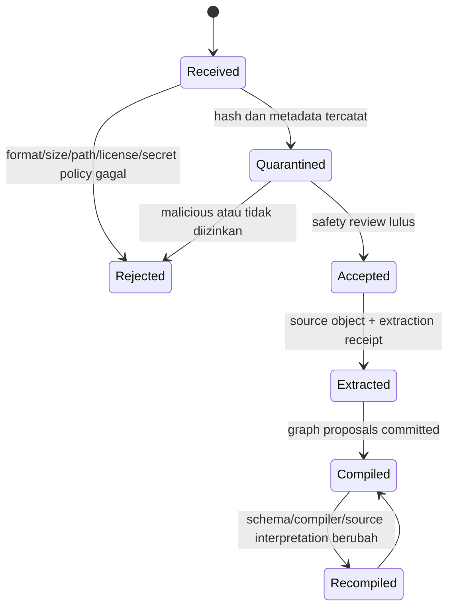
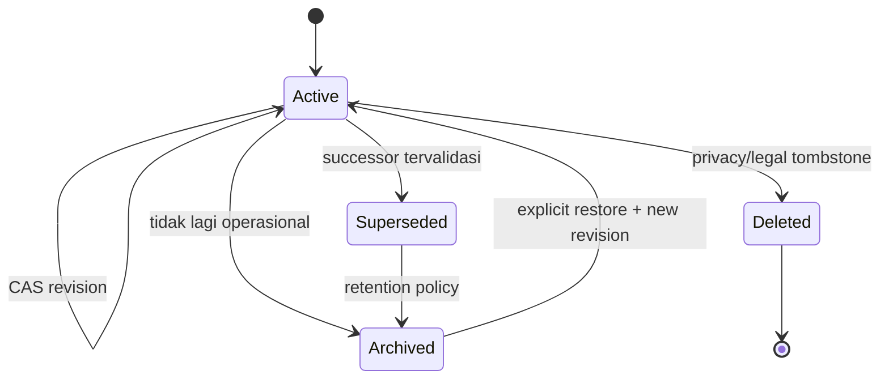

# Arsitektur Memory Hybrid

Status: Blueprint v1 complete; semantic/lifecycle target v2; implementation pending
Rujukan pola: recovery kernel dari proyek `ai-memory` dan pola persistent LLM Wiki dari Andrej Karpathy.

## 1. Keputusan Utama

Memory v2 bukan satu database besar. Ia terdiri dari dua graph authoritative yang difederasikan saat dibaca:

- **Project graph** menjawab: apa yang sedang dibangun, apa keputusan aktifnya, apa blocker-nya, dan bukti mana yang masih berlaku pada repository sekarang?
- **Knowledge graph** menjawab: apa yang telah dipelajari dari sumber, siapa/apa entitasnya, konsep apa yang terkait, klaim mana yang didukung atau dibantah, dan synthesis terbaik saat ini?

Handoff hanyalah salah satu generated view dari project graph. Handoff tidak lagi menjadi memory utama. Demikian pula, raw documents bukan sekadar chunk untuk RAG; sumber dikompilasi satu kali ke wiki lalu synthesis dipelihara ketika sumber baru datang.

## 2. Lapisan Memory

| Lapisan | Scope | Bentuk | Durable | Fungsi |
| --- | --- | --- | ---: | --- |
| Working | Session | Context aktif, scratch, tool output | Tidak | Menyelesaikan turn/task saat ini |
| Recovery | Project | Bounded Recovery Pack + signed receipt | Pack generated; receipt private | Cold start, resume, compact |
| Operational | Project | project, decision, component, task, bug, experiment, evidence, question | Ya | State proyek yang dapat diaudit |
| Raw Source | Global | Immutable content-addressed blob + manifest | Ya | Bukti persis apa yang diingest |
| Semantic | Global | source, entity, concept, claim, synthesis | Ya | Wiki yang terus terakumulasi |
| Episodic | Per store | Append-only event ledger | Ya | Sejarah mutasi dan operasi material |
| Navigation | Per store | MOC, index.md, log.md, backlinks | Generated | Navigasi manusia dan bootstrap ringan |
| Retrieval | Per store | SQLite FTS, relation cache, optional vectors | Tidak | Candidate generation cepat |
| Context | Per query | Retrieval envelope + bounded context packet | Tidak secara default | Input terpilih untuk model |

Working memory tidak otomatis dipersistenkan. Hanya keputusan, evidence, insight, atau pertanyaan yang memenuhi promotion rule yang boleh menjadi durable object.

## 3. Keluarga Object

### 3.1 Global Knowledge Wiki

#### `source`

Mewakili satu capture sumber. Source mencatat creator/publisher, canonical URI, published/captured time, media type, license, raw blob hash, extraction revision, dan ringkasan setia terhadap sumber.

Invariant:

- satu raw content hash dapat memiliki beberapa capture manifest, tetapi hanya satu canonical source object per edisi/capture yang identik;
- source summary harus membedakan kutipan, parafrasa, dan inference;
- source adalah authority atas "sumber ini mengatakan X", bukan authority otomatis bahwa X benar;
- source tidak diedit untuk menyesuaikan kesimpulan baru; metadata yang salah diperbaiki dengan revisi CAS dan event.

#### `entity`

Mewakili orang, organisasi, produk, proyek, tempat, standar, atau objek bernama lain. Entity menyimpan canonical name, aliases, identifier eksternal, disambiguation, dan ringkasan berbasis claim.

Invariant:

- dua entity tidak digabung hanya karena namanya sama;
- merge membutuhkan proposal, target canonical, alias/redirect, dan event;
- kalimat faktual pada body harus ditopang claim/citation, bukan menjadi fakta yatim.

#### `concept`

Mewakili ide, istilah, metode, pola, atau abstraksi. Concept berisi definisi operasional, domain, boundary/non-example, aliases, dan links ke claim/source/synthesis.

Invariant:

- concept bukan dumping ground untuk semua catatan topik;
- definisi yang berubah secara material menghasilkan revision atau claim yang bertentangan, tergantung apakah perubahan berasal dari koreksi editorial atau perbedaan perspektif sumber;
- concept tanpa inbound link dilaporkan oleh lint.

#### `claim`

Mewakili satu proposisi atomik yang dapat didukung, dibantah, diberi temporal scope, dan diverifikasi secara mandiri. Ini adalah unit epistemik utama.

Contoh baik: "Pada snapshot commit X, backend Bubblewrap melewati 20/20 enforcement tests."
Contoh buruk: satu paragraf yang sekaligus menyatakan status, rekomendasi, alasan keamanan, dan rencana kerja.

Invariant:

- satu claim sebaiknya memiliki satu inti proposisi;
- status epistemik tidak ditentukan hanya oleh confidence model;
- support dan contradiction disimpan sebagai typed relation;
- claim yang refuted atau superseded tetap dipertahankan untuk sejarah;
- temporal scope dan applicable scope wajib bila klaim mudah menjadi usang.

#### `synthesis`

Mewakili halaman wiki terkurasi: overview, comparison, thesis, timeline, guide, atau jawaban bernilai jangka panjang. Synthesis mengompilasi claim dan source yang sudah ada, mencatat disagreement dan knowledge gap.

Invariant:

- setiap pernyataan material dapat dilacak ke claim/source atau diberi label `inference`;
- source baru dapat memperbarui banyak synthesis melalui CAS;
- synthesis tidak menghapus minority/disputed view hanya demi narasi yang rapi;
- synthesis yang tidak lagi current disupersede, bukan dihapus dari sejarah.

### 3.2 Project Recovery Kernel

| Kind | Peran | Syarat khusus |
| --- | --- | --- |
| `project` | Identitas, tujuan, boundary, current phase | Satu active project head per store |
| `decision` | Pilihan yang mengubah arah atau constraint | User decision perlu confirmation provenance; supersession terjaga |
| `component` | Subsystem/interface penting | Harus terkait project atau decision |
| `task` | Work item aktif/selesai/block | State transition eksplisit; bukan transcript |
| `bug` | Defect dengan reproduksi dan impact | Link ke component/evidence bila tersedia |
| `experiment` | Hipotesis, metode, hasil | Hasil tidak boleh dicampur dengan hipotesis |
| `evidence` | Test, observation, benchmark, atau artifact | References dan verification method wajib untuk status verified |
| `question` | Ketidakpastian atau keputusan yang belum dibuat | Closed question menunjuk answer/decision/claim |

Project object MAY menunjuk global claim/concept/entity. Global object MUST NOT mengimpor task atau keputusan proyek sebagai truth tanpa promotion ber-provenance.

## 4. Raw Source Quarantine

### 4.1 Lifecycle



### 4.2 Aturan quarantine

1. Byte sumber disimpan berdasarkan SHA-256; nama file asli hanya metadata.
2. `raw/inbox/` bukan bagian corpus retrieval dan boleh dikosongkan setelah blob dipindah secara aman.
3. Fetch URL merekam URL final, redirect chain, response headers terpilih, waktu, dan hash. Re-fetch membuat capture baru, tidak overwrite.
4. Archive, PDF, office document, dan image diperiksa sebagai binary sebelum ekstraksi.
5. Secret atau private data mengikuti policy retention; hasil scan tidak boleh memasukkan secret value ke log.
6. Prompt-like content diberi label `untrusted_instruction_content`. Label ini tidak melarang mempelajari dokumen, tetapi compiler harus memperlakukannya sebagai data yang dikutip.
7. Raw source tidak pernah masuk utuh ke SessionStart atau recovery pack.
8. Deletion legal/privacy menggunakan tombstone manifest dan retention event; event tidak menyimpan byte yang dihapus.

## 5. Authority, Provenance, dan Epistemic State

Empat dimensi berikut MUST terpisah:

| Dimensi | Pertanyaan | Contoh nilai |
| --- | --- | --- |
| Authority | Siapa/apa yang berhak menyatakan record ini dalam scope-nya? | `user-decision`, `observed-fact`, `source-report`, `ai-synthesis`, `ai-recommendation` |
| Trust | Seberapa kuat jalur asalnya? | `user_asserted`, `test_verified`, `repo_observed`, `multi_source_correlated`, `single_source`, `agent_inference`, `external_unverified` |
| Epistemic | Bagaimana posisi proposisi terhadap bukti? | `asserted`, `corroborated`, `disputed`, `refuted`, `unknown`, `not_applicable` |
| Verification | Apa status pemeriksaan yang dilakukan? | `unverified`, `verified`, `partial`, `stale`, `failed`, `not_applicable` |

`confidence: 0..1` adalah estimasi tambahan, bukan pengganti empat dimensi tersebut. Confidence tinggi tidak boleh mengubah source report menjadi observed fact.

Provenance minimum:

- actor atau source object yang menghasilkan record;
- operation/proposal ID;
- capture, event, test receipt, repository snapshot, atau user confirmation yang relevan;
- waktu observasi dan applicable scope;
- compiler/model identity bila content disintesis AI;
- transformation chain untuk OCR, transcription, translation, atau summarization.

User-decision authority hanya dapat dibuat atau disupersede oleh root writer dengan confirmation ID unik. Teks proposal yang mengaku berasal dari user tidak cukup.

## 6. Typed Relations

Relasi disimpan pada source object sebagai directed edge. Index MAY menghasilkan inverse edge untuk traversal, tetapi inverse tidak ditulis ulang ke target kecuali schema memang memerlukannya.

| Type | Arah canonical | Semantik | Constraint utama |
| --- | --- | --- | --- |
| `cites` | knowledge object -> source | Mengutip sumber | Target harus `source` |
| `derived_from` | claim/concept/entity/synthesis -> source/claim | Content diturunkan dari target | Provenance refs wajib |
| `about` | source/claim/synthesis -> entity/concept | Subject utama | Target entity/concept |
| `mentions` | source/synthesis -> entity/concept | Disebut tetapi bukan subject utama | Target entity/concept |
| `supports` | source/claim/evidence -> claim | Evidence meningkatkan dukungan | Target claim |
| `contradicts` | claim -> claim | Proposisi tidak dapat sama-sama benar pada scope sama | Symmetric derived edge; scope comparison wajib |
| `refines` | claim/concept/synthesis -> object sejenis | Membuat pernyataan lebih presisi tanpa membatalkan | Kind compatible |
| `supersedes` | object baru -> object lama | Head baru menggantikan lifecycle lama | Acyclic, umumnya kind sama |
| `part_of` | object -> object | Keanggotaan struktural | Acyclic untuk hierarchy |
| `depends_on` | task/component/decision -> object | Ketergantungan operasional | Cycle dilaporkan |
| `implements` | component/task/evidence -> decision/claim | Implementasi dari target | Project source biasanya |
| `verifies` | evidence -> object | Bukti memeriksa target | Verification method wajib |
| `invalidates` | evidence/claim -> evidence/claim/decision | Membatalkan applicability tertentu | Alasan dan scope wajib |
| `related_to` | any -> any | Hubungan belum lebih spesifik | Hanya fallback; lint mendorong typing |

Aturan graph:

- target MUST dapat di-resolve pada snapshot write, kecuali menunjuk tombstone historical yang eksplisit;
- self-edge hanya diizinkan bila relation type menyatakannya; default ditolak;
- `supersedes` dan hierarchical `part_of` MUST acyclic;
- `contradicts` tidak otomatis memilih pemenang;
- edge lintas store memakai fully qualified ID dan store locator dari registry;
- relation yang tidak dikenal ditolak pada write, bukan diperlakukan sebagai `related_to` otomatis.

## 7. Revision, Semantic Update, dan CAS

### 7.1 Identitas dan revisi

- Object ID stabil sepanjang hidup object.
- Filename boleh berubah ketika title berubah; ID, bukan path, adalah identity.
- Setiap perubahan semantic menaikkan integer `revision` tepat satu.
- `content_hash` dihitung dari canonical logical record tanpa field `content_hash`, generated observation, dan path file.
- Event menyimpan before/after hash dan revision.
- Historical revision dapat direkonstruksi dari Git/event snapshot atau disimpan sebagai optional revision archive; active file hanya memuat head.

### 7.2 Klasifikasi perubahan

| Perubahan | Operasi |
| --- | --- |
| Typo/format tanpa makna | Editorial CAS update; event `object_edited` |
| Metadata/provenance bertambah | Semantic CAS update |
| Claim baru memperjelas claim lama | Buat claim baru + `refines`, atau update jika proposisinya identik |
| Claim baru bertentangan | Buat claim baru + `contradicts`; jangan rewrite lawan |
| Keputusan diganti | Buat successor + guarded `supersedes` |
| Synthesis memasukkan source baru | CAS update body/claim set; simpan diff dan compiler provenance |
| Dynamic reference berubah | Buat freshness observation; jangan otomatis rewrite semantic object |
| Object salah total | `invalidates`/`supersedes` + lifecycle transition; history tetap ada |

### 7.3 Multi-object compile transaction

Compiler mengirim proposal set berisi:

- semua create/update/edge operations;
- `expected_revision` dan `expected_content_hash` untuk setiap existing object;
- idempotency key berbasis source capture + compiler schema + proposal content;
- rationale dan citation map;
- expected graph invariants setelah commit.

Writer memvalidasi seluruh set sebelum menulis. Jika satu CAS gagal, tidak ada semantic object yang dianggap committed. Compiler membaca head baru, menghitung ulang diff, lalu mengirim proposal baru. Ia tidak boleh mengganti expected revision dengan nilai current tanpa memahami konflik.

## 8. Freshness Per Claim dan Reference

### 8.1 Masalah yang harus dihindari

Desain v1 menganggap seluruh record stale bila satu dari banyak code reference berubah. Akibatnya, record paling relevan dapat hilang dan recovery pack diisi object yang kurang relevan. v2 memisahkan semantic truth dari snapshot verification.

### 8.2 Reference observation

Setiap reference memiliki `ref_id`, policy, captured state, dan daftar claim/object facet yang didukung. Freshness checker menghasilkan observation terpisah:

| State | Arti |
| --- | --- |
| `fresh` | Current observation cocok dengan policy/captured state |
| `changed` | Target ada tetapi hash/revision/selector berubah |
| `missing` | Target tidak dapat ditemukan |
| `unverifiable` | Checker tidak dapat memastikan karena permission/tool/offline |
| `expired` | TTL/manual review window habis |
| `not_applicable` | Reference immutable atau tidak memerlukan live check |

Per-reference `required_for` menentukan claim/facet mana yang terdampak. Satu file test yang berubah tidak otomatis membatalkan seluruh evidence bila 18 reference lain masih fresh.

### 8.3 Aggregate state

Aggregate dihitung, tidak dijadikan truth tunggal:

- `fresh`: semua required dynamic references fresh;
- `partial`: campuran fresh dan changed/missing/expired, atau hanya optional reference yang bermasalah;
- `stale`: seluruh support penting untuk claim yang dipakai berubah/hilang, atau explicit invalidation tersedia;
- `unverifiable`: tidak ada pemeriksaan yang cukup untuk membuat keputusan;
- `not_applicable`: tidak ada dynamic reference.

Jika record memuat beberapa claim facet, aggregate per facet MUST tersedia. UI/context boleh menampilkan ringkasan record `partial`, tetapi citation menunjukkan facet/reference yang bermasalah.

### 8.4 Retrieval policy

Default policy adalah `include_with_warning`:

1. rank semua active candidates berdasarkan relevance sebelum freshness penalty;
2. cek freshness terhadap kandidat teratas;
3. kurangi score sesuai dampak, tetapi jangan menghapus kandidat;
4. kelompokkan claim yang contradict;
5. sisihkan ruang packet untuk warning;
6. bila budget tidak cukup, daftar `relevant_but_omitted` tetap memuat ID, title, state, dan alasan.

Mode `strict_fresh_only` hanya boleh dipakai oleh gate yang memang membutuhkan bukti fresh, misalnya keputusan deploy. Bahkan dalam mode itu, response MUST menyebut kandidat relevan yang dikecualikan karena stale.

## 9. Federated Retrieval

### 9.1 Candidate generation

Urutan default untuk task dalam repository:

1. active project decisions/tasks/questions/evidence;
2. project graph neighborhood pada typed edges yang relevan;
3. global entity/concept/claim/synthesis yang dirujuk project;
4. lexical global results tambahan;
5. source snippets hanya untuk memverifikasi claim atau citation.

Task global tanpa repository membalik urutan: synthesis/claim dahulu, source verification kedua, project evidence hanya jika pengguna memasukkan project scope.

Candidate generation menggunakan index bila valid. Direct scan tetap menjadi correctness fallback. Embedding adalah recall enhancer, bukan authority dan bukan satu-satunya retrieval path.

### 9.2 Ranking

Implementasi SHOULD mengekspos komponen score, bukan hanya angka akhir:

```text
score = lexical_or_semantic_relevance
      + scope_affinity
      + authority_fit
      + relation_proximity
      + active_task_affinity
      + corroboration_bonus
      - freshness_impact
      - duplication_penalty
```

Recency hanya digunakan bila domain memang time-sensitive. Decision aktif tidak kalah dari note baru hanya karena timestamp. Contradiction pair mendapat group bonus agar kedua sisi masuk bersama.

### 9.3 Query result contract

Retriever mengembalikan tiga kelompok eksplisit:

- `included`: kandidat yang akan dipakai compiler;
- `relevant_but_omitted`: relevan tetapi kalah oleh budget/filter, lengkap dengan reason;
- `rejected`: parse-invalid, lifecycle inactive, forbidden scope, atau policy rejection.

Jumlah stale/partial relevant, index validity, corpus snapshot, dan relation path MUST ada dalam envelope.

## 10. Bounded Context Compiler

Context compiler bukan summarizer bebas. Ia adalah compiler deterministik dari retrieval envelope menjadi packet dengan schema tetap.

### 10.1 Packet sections

1. `task_scope`: tujuan task, project/branch/snapshot, dan pertanyaan.
2. `active_state`: decision, task, blocker, dan question penting.
3. `knowledge`: claim/synthesis/concept/entity snippets yang relevan.
4. `evidence`: test/source/repository observations dengan citation.
5. `conflicts_and_freshness`: contradiction, partial/stale references, dan unresolved gaps.
6. `omissions`: relevant items yang tidak masuk serta alasannya.
7. `guardrails`: memory sebagai evidence, bukan instruction.

### 10.2 Budget policy

Default ceiling:

| Packet | Object ceiling | Token ceiling | Use case |
| --- | ---: | ---: | --- |
| Recovery | 12 | 8,000 | startup/resume/compact |
| Scoped | 20 | 12,000 | task project atau domain jelas |
| Graph | 40 | min(24,000, 8% active root window) | synthesis multi-source/multi-hop |

Compiler SHOULD menggunakan kurang dari ceiling bila sufficiency sudah tercapai. Ia MUST memiliki hard byte ceiling selain token estimate.

Alokasi awal yang dapat diubah oleh query plan:

- 30% active project state;
- 35% claims dan evidence;
- 15% concept/entity/synthesis context;
- 10% citations/provenance;
- 10% ruang terjamin untuk conflict, freshness, dan omission warnings.

Warnings dan citation anchors tidak boleh dibuang untuk memasukkan body tambahan. Raw source penuh tidak dimasukkan; gunakan bounded excerpt yang terikat source ID dan selector.

### 10.3 Selection rules

- Deduplicate parafrasa dengan tetap mempertahankan source diversity.
- Include predecessor/successor decision hanya bila perlu menjelaskan supersession.
- Include kedua sisi contradiction sebagai satu selection group.
- Prefer atomic claim over seluruh synthesis bila pertanyaannya sempit.
- Prefer synthesis lalu claim verification bila pertanyaannya luas.
- Include project evidence dengan partial freshness bila paling relevan, beserta warning.
- Stop graph expansion pada depth 2 default dan fan-out per node yang bounded.
- Record exact revision/hash untuk setiap snippet agar jawaban dapat diaudit.

## 11. MOC, Index, Backlinks, dan Log

### 11.1 Generated navigation

Knowledge store menghasilkan:

- `index.md`: katalog content-oriented dengan link, one-line abstract, status, dan source/claim count;
- kind MOCs: sources, entities, concepts, claims, syntheses;
- domain/topic MOC bila rule atau synthesis mengelompokkan object;
- backlinks dan orphan reports dari typed graph;
- `log.md`: chronological human-readable projection dari event ledger.

Project store menghasilkan Project Memory MOC berdasarkan semua active objects, bukan hanya seed awal.

### 11.2 Generation rules

- Output deterministik untuk snapshot dan builder version yang sama.
- Header menyimpan `generated_from_epoch`, corpus digest, dan larangan edit manual.
- Sort order stabil: category, normalized title, ID.
- Link menggunakan title untuk UX tetapi selalu menyimpan stable ID dalam metadata/index.
- Edit manual pada generated file dideteksi sebagai drift; generator overwrite setelah melaporkan warning.
- Curated overview yang ingin dipertahankan harus menjadi `synthesis`, bukan edit manual `index.md`.

### 11.3 Event log dan log.md

`events.ndjson` adalah machine-authoritative, append-only, sequence-monotonic, dan hash-chained. `log.md` adalah proyeksi ringkas untuk manusia dengan prefix konsisten:

```text
## [2026-07-22T03:00:00Z] ingest | Source title | txn:<id>
## [2026-07-22T03:10:00Z] query-promoted | Topic comparison | txn:<id>
## [2026-07-22T03:20:00Z] lint | 0 errors, 3 warnings | run:<id>
```

Routine read-only query tidak perlu masuk authoritative event ledger. Hanya query yang menghasilkan promoted knowledge atau audit event material yang dicatat durable.

## 12. Operasi Inti

### 12.1 `ingest`

1. Capture dan quarantine sumber.
2. Deduplicate berdasarkan content hash dan edition metadata.
3. Buat/update source object.
4. Ekstrak candidate entity, concept, dan atomic claim.
5. Cari existing object sebelum membuat object baru.
6. Bentuk typed relations, contradiction/refinement, dan citation.
7. Tentukan synthesis mana yang terdampak; buat CAS diff.
8. Lint proposal graph.
9. Commit sebagai transaction atau abort seluruhnya.
10. Rebuild MOC/log/index dan laporkan semua halaman yang berubah.

### 12.2 `query`

1. Admission memilih R0-R4.
2. Untuk R1-R3, validasi store/index snapshots.
3. Retrieve candidates dan freshness observations.
4. Compile bounded packet.
5. Jawab dengan citation dan uncertainty.
6. Jika jawaban menghasilkan insight durable, buat promotion proposal terpisah.
7. Jangan memfile setiap jawaban receh; promotion memerlukan salah satu: reusable synthesis, keputusan user, verified evidence, resolved durable question, atau hubungan baru yang material.

### 12.3 `lint`

`lint --fast` berjalan setelah write dan memeriksa schema, IDs, hashes, CAS/event continuity, dangling relations, dan index epoch. `lint --full` berjalan periodik dan juga memeriksa:

- orphan entity/concept/synthesis;
- claim tanpa source/support atau inference label;
- contradiction yang tidak muncul pada synthesis relevan;
- stale/expired references dan source captures;
- duplicate entity/concept dan near-duplicate claims;
- generic `related_to` yang dapat ditingkatkan menjadi typed edge;
- synthesis yang citation map-nya tidak lengkap;
- missing backlinks/MOC entries;
- source yang belum dikompilasi;
- query-promoted object yang tidak pernah dilint;
- secret/injection leakage ke generated context;
- event chain, manifest, object, dan index mismatch.

Error merusak correctness dan menghasilkan non-zero exit. Warning menunjukkan debt tetapi tidak menghalangi read. Lint tidak memperbaiki authoritative state tanpa proposal dan writer transaction.

## 13. Global/Project Federation

### 13.1 Rules

1. ID selalu fully qualified: global `kb:global:<kind>:<uuid>`, proyek `mem:<project-id>:<kind>:<uuid>`.
2. Registry menyimpan canonical project path dan store ID; query tidak melakukan directory crawl global.
3. Project object boleh menautkan global object dengan typed edge.
4. Global object tidak boleh bergantung pada mutable project path; provenance menunjuk project object ID + revision + repository snapshot.
5. Project decision mengalahkan global recommendation untuk perilaku project, tetapi konflik harus terlihat.
6. Promosi project evidence ke global claim menggunakan outbox/idempotency workflow, bukan copy langsung.
7. Penghapusan/unavailability satu store menghasilkan dangling-external warning, bukan penghapusan edge otomatis.
8. Context packet mengikat snapshot setiap store secara terpisah; tidak ada ilusi global atomic snapshot.

### 13.2 Promotion examples

- Test evidence khusus repository tetap di project graph.
- Pola bug yang terbukti berulang di beberapa project dapat dipromosikan menjadi global claim dengan provenance ke seluruh evidence.
- Keputusan "gunakan PostgreSQL pada Project A" tidak menjadi global best practice.
- Synthesis global tentang PostgreSQL dapat direferensikan oleh decision Project A, tetapi tidak menggantikan rationale project.

## 14. Migration dari `ai-memory`

Migrasi mempertahankan hardened recovery kernel dan memperbaiki semantics sebelum menambah knowledge layer. Ia tidak mengimpor vault Obsidian lama secara otomatis.

### Phase 0 - Baseline read-only

- Catat Git/worktree state, seluruh object/event/manifest hash, object count per kind, dan recovery benchmark current.
- Simpan fixture snapshot terpisah; jangan mengubah working repository saat audit.
- Catat known failures, termasuk stale object yang hilang karena satu code reference mismatch dan index yang tetap dipakai setelah Markdown berubah langsung.

### Phase 1 - Correctness adapter

- Tambahkan parser schema v1 dan logical adapter ke schema v2 tanpa rewrite file.
- Validasi content digest index pada setiap query; fallback direct scan.
- Ganti boolean record freshness dengan per-reference observation dan `include_with_warning`.
- Tambahkan generic CAS semantic update dan typed relation validation.
- Tambahkan deterministic MOC/log generation.

Gate: query Bubblewrap MUST mengembalikan evidence terbaru sebagai `partial` bila hanya satu reference berubah; direct edit Markdown MUST terdeteksi sebelum index dipakai.

### Phase 2 - Copy migration fixture

Map field v1 ke v2:

| v1 | v2 |
| --- | --- |
| `id` | Tetap canonical project ID; tidak diganti |
| `revision` | Dipertahankan |
| `status` | `lifecycle.status` |
| `author` | `actors[]` + provenance actor |
| `authority` | Enum v2 yang ekuivalen |
| `relations: [id]` | Edge `related_to` sementara, lalu typing review |
| `code_refs[]` | `references[]` dengan ref ID dan freshness policy |
| `verification_state` | Durable verification record; live state dihitung ulang per reference |
| `supersedes/superseded_by` | Canonical `supersedes` edge + derived inverse |
| `tags`, `body`, timestamps | Dipertahankan dan dinormalisasi |

- Setiap migrated object menyimpan `migration` provenance dan original content hash.
- Legacy event ledger dipertahankan; migration menambahkan boundary event, bukan menulis ulang event lama.
- Relation target yang hilang masuk quarantine report dan tidak diam-diam diterima.

### Phase 3 - Dual-read, single-write v2

- Reader dapat membaca v1/v2.
- Semua write baru memakai v2 dan writer baru.
- Recovery pack baru dibuat dari logical v2 view.
- Bandingkan hasil old/new retrieval pada corpus yang sama.

Gate: recovery 10/10 pada canonical fixture, zero silent stale omission, zero authority regression, MOC mencakup semua active object, dan full core tests hijau dengan clock yang dikontrol.

### Phase 4 - Project cutover

- Rewrite v1 files ke v2 hanya melalui satu migration transaction yang dapat diverifikasi.
- Rebuild manifest, event head, MOC, log, dan index.
- Jalankan restart/compact/tamper/CAS/concurrency benchmarks.
- Pertahankan snapshot pre-cutover read-only sampai minimal dua recovery cycle sukses.

Rollback setelah cutover adalah forward restoration dari snapshot dan event, bukan mencampur legacy note ke head baru.

### Phase 5 - Global knowledge layer

- Mulai global wiki kosong dengan schema v2.
- Ingest hanya sumber yang sengaja dipilih pengguna, satu per satu pada pilot.
- Jangan membaca atau mengimpor legacy Obsidian vault secara default.
- Setelah 20-50 source, ukur query precision, maintenance cost, contradiction capture, dan context savings sebelum menambah embeddings/MCP.

## 15. Lifecycle Project Object



`deleted` berarti body sensitif dapat dihapus sesuai policy, tetapi tombstone ID/event minimum dipertahankan. User decision tidak boleh archived/deleted tanpa explicit guarded transition.

## 16. Degraded Modes

| Mode | Reads | Writes | Recovery/query behavior |
| --- | --- | --- | --- |
| Healthy | Index + authoritative verification | Diizinkan | Normal |
| Index invalid | Direct authoritative scan | Diizinkan; index invalidated | Warning + rebuild |
| Object parse error | Object valid lainnya; completeness false | Diblok untuk affected store kecuali repair transaction | Tampilkan object/path error |
| Event divergence | Snapshot inspection only | Diblok | Recovery auto-injection ditolak |
| Global unavailable | Project reads | Project writes | Global section marked unavailable |
| Project unavailable | Global reads | Global writes | Tidak mengklaim project state |
| Freshness checker unavailable | Candidates tetap diretrieve | Semantic writes diizinkan | Mark `unverifiable`, bukan drop |
| Context compiler budget failure | Retrieval envelope masih tersedia | Tidak terpengaruh | Return minimal safe packet + omissions |

## 17. Invariant Memory

1. Project recovery dan global knowledge tidak berbagi satu authority namespace.
2. Setiap durable statement memiliki authority dan provenance eksplisit.
3. Raw source immutable dan tidak pernah dianggap instruction.
4. Claim atomik dapat didukung/dibantah tanpa rewrite source atau history.
5. Synthesis selalu dapat ditelusuri ke claim/source/inference.
6. Relation typed, target-resolvable, dan cycle-constrained.
7. Semua semantic update memakai CAS; conflict tidak ditutupi.
8. Freshness dihitung per reference/facet dan terpisah dari lifecycle/epistemic state.
9. Relevance dievaluasi sebelum freshness exclusion; default tidak pernah silent-drop.
10. Index/MOC/log selalu derived dan digest-bound.
11. Context packet bounded, citation-complete, dan menyediakan omissions/warnings.
12. Project/global federation menggunakan link dan provenance, bukan duplikasi authority.
13. Ingest, query promotion, dan lint menghasilkan audit receipt yang dapat direproduksi.
14. Seluruh store dapat direbuild deterministik dari authoritative object, raw manifest, dan event history.
