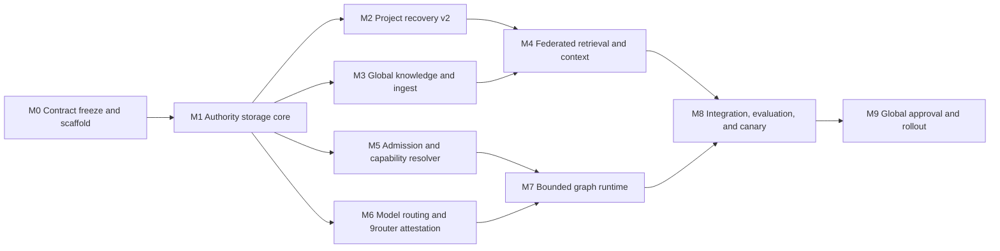

# Implementation Roadmap

- Status: implementation plan v1
- Scope: project-local implementation through staged global deployment
- Default root profile: Tera Max
- Global mutation: prohibited before Milestone M9 approval
- Implementation checkpoint: M0 Contract Freeze, M1 Authority Storage Core, M2
  Project Recovery Kernel v2, M3 Global Knowledge Wiki and Ingest, M4
  Federated Retrieval and Bounded Context, M5 Admission, Permissions, and
  Capability Resolver, M6 Model Registry and 9router Attestation, and M7
  Bounded Work-Graph Runtime completed locally on 2026-07-23; evidence is in
  `implementation-status.yaml` and the matching `artifacts/m0-verification.json`
  through `artifacts/m7-verification.json` receipts.
- Strict next ready milestone remains M8 Integrated Evaluation and Local Canary.
- Practical V1 checkpoint: `PRACTICAL_V1_APPLIED_AND_CANARY_PASS`. The bounded
  bridge, operator-trusted router-log contract, source-bound skill/wrapper, and
  rollback helper were installed from an exact approved packet, read back, and
  passed a no-network disposable canary. This does not complete M8 or strict M9.
- Activation V2 A0 checkpoint: local design fixtures, threat model, and
  fail-closed contract tests are complete. See
  `docs/25-ACTIVATION-V2-A0-FIXTURES-AND-THREAT-MODEL.md`. This adds no runtime,
  hook, automatic capture, route, store, or global target and does not alter
  M8/M9 status or promotion gates.

## 1. Delivery Strategy

Build the system as a dependency graph, not as one linear queue. A small storage
and validation foundation must land first. After that, project recovery, global
knowledge, workflow admission, and model routing can progress in parallel because
their write scopes and contracts are distinct.



Milestones may be implemented in separate sessions. A session should complete one
milestone or leave a tested checkpoint with explicit remaining acceptance items.
No milestone is marked complete from agent confidence alone.

## 2. Cross-Cutting Rules

Every milestone MUST:

1. reference the FR/NFR/AC or ADR it implements;
2. keep authoritative state human-readable and derived state disposable;
3. use deterministic tests before model-based review;
4. preserve dirty user work and avoid destructive Git/filesystem operations;
5. keep private data and secrets out of fixtures, prompts, logs, and artifacts;
6. record exact commands, test results, changed paths, and unresolved risks;
7. maintain a rollback path to the previous milestone;
8. update an implementation status file and the next-session prompt;
9. avoid all global Codex or old-vault mutation until M9;
10. stop if a required quality, authority, or route gate cannot be proven.

Recommended implementation status file created in M0:

```yaml
blueprint_version: 1
current_milestone: M0
milestones:
  M0: in_progress
  M1: pending
  M2: pending
  M3: pending
  M4: pending
  M5: pending
  M6: pending
  M7: pending
  M8: pending
  M9: pending
last_verified_at: null
last_test_receipt: null
global_activation: disabled
```

## 3. Milestone M0 - Contract Freeze and Local Scaffold

### Goal

Turn the blueprint into a reproducible local project without implementing
semantic behavior prematurely.

### Completion Record

Status: complete on 2026-07-22.

- Scope: project-local package scaffold, exact extracted JSON Schemas, synthetic
  valid/invalid fixtures, deterministic clock/store fixtures, a seven-alias
  placeholder profile registry, ignore rules, and reproducible checks.
- Evidence: `make check` and `python3 scripts/check_clean_room.py` pass; see
  `artifacts/m0-verification.json`.
- Requirements: NFR-12 and AC-11 are implemented and verified for this
  milestone.
- Rollback: remove only M0-local scaffold paths. No global config, old vault, or
  `ai-memory` data was read or changed.

### Outputs

- project metadata and a minimal Python package layout;
- `src/second_brain/`, `tests/`, `schemas/`, `config/`, `fixtures/`, `scripts/`,
  `artifacts/`, and `dist/global/` directories with clear ownership;
- extracted, machine-validated JSON Schemas corresponding to
  `docs/06-DATA-SCHEMAS.md`;
- one authoritative model-profile registry template with placeholder adapter
  fields, not guessed 9router values;
- deterministic test clock and temporary-store fixtures;
- `implementation-status.yaml` and local developer commands;
- ignore rules for runtime keys, receipts, databases, caches, and private
  artifacts.

### Acceptance

- every extracted schema parses and validates its canonical example;
- invalid duplicate keys, unknown fields, wrong IDs, and malformed timestamps are
  rejected by fixtures;
- no executable reads or writes outside this repository;
- no dependency is added without license and necessity review;
- all documented local commands work from a clean temporary directory;
- blueprint links and terminology checks pass.

### Suggested profiles

Tera Max integrates. Sol xhigh may build the package/test scaffold, Tera xhigh may
extract contract checks, Luna xhigh may generate bounded fixtures, and GPT-5.5
xhigh performs read-only contract review. Use a graph only if these scopes are
actually independent.

## 4. Milestone M1 - Authoritative Storage Core

### Goal

Implement the shared correctness kernel used by both durable domains.

### Completion Record

Status: complete on 2026-07-22.

- Scope: project-local strict parsing/canonicalization, explicit-store CAS,
  single-writer transactions, atomic recovery, event and manifest integrity,
  path containment, degraded fail-closed reads, lint, content policy, and
  derived-state invalidation.
- Evidence: `artifacts/m1-verification.json` and
  `docs/13-M1-AUTHORITATIVE-STORAGE-CORE.md`; the full 47-test suite, `make
  check`, and the clean-room check pass.
- Requirements: FR-07, FR-08, FR-09, FR-16, FR-18, FR-19; NFR-08, NFR-09,
  NFR-12; ADR-001, ADR-005, and ADR-006 are implemented and verified for the
  shared-kernel scope.
- Rollback: revert M1 implementation paths only. Preserve any caller-created
  authority store for recovery or explicit operator review; no global or source
  data was changed.

### Outputs

- safe YAML/Markdown and JSON/NDJSON parsers;
- RFC 8785-compatible canonicalization and SHA-256 helpers;
- ID/store/kind validation and path/symlink containment checks;
- object repository with CAS revision and content-hash checks;
- single-writer lock, transaction journal, atomic replace, event append, event
  hash chain, and store manifest updates;
- deterministic recovery from interrupted transactions;
- derived-state invalidation interface;
- fast lint for schema, hash, event, relation target, and authority failures;
- secret/instruction-content classification boundary with redacted diagnostics.

### Acceptance

- create, replace, conflict, idempotency, crash recovery, and concurrent writer
  fixtures pass;
- no last-write-wins path exists;
- event/object/manifest divergence forces read-only degraded mode;
- path traversal and symlink escape are rejected before any write;
- authoritative mutations are atomic in failure-injection tests;
- deleting derived state loses no authoritative information.

### Requirements

FR-07, FR-08, FR-09, FR-16, FR-18, FR-19; NFR-08, NFR-09, NFR-12; ADR-001,
ADR-005, ADR-006.

## 5. Milestone M2 - Project Recovery Kernel v2

### Goal

Preserve the useful `ai-memory` recovery design while correcting its known recall,
freshness, index, relation, MOC, and test defects.

### Completion Record

Status: complete and locally verified on 2026-07-22.

- Scope: public M1 snapshot consumption, bounded project retrieval and freshness
  observations, physical-index validation/direct scan, derived MOC/log, bounded
  recovery packets/checkpoints/HMAC receipts, and read-only synthetic v1
  inventory/mapping.
- Evidence: `artifacts/m2-verification.json` and
  `docs/14-M2-PROJECT-RECOVERY-KERNEL.md`; focused M2 tests, `make check`, and
  the clean-room check pass. An independent read-only security re-review found
  no material findings after the legacy exclusion and bounded-reference fixes.
- Requirements: FR-12, FR-14, FR-16, FR-20; NFR-04, NFR-05, NFR-08, NFR-09;
  AC-05, AC-06, AC-07, AC-10; ADR-001 and ADR-005 are implemented and verified
  for the local M2 scope.
- Rollback: revert only M2-local code, fixtures, tests, and derived/private
  output. Preserve caller-created M1 authority stores and never delete them as
  part of a code rollback; no global configuration or source project changed.

### Outputs

- v1 read-only compatibility adapter and v2 project object repository;
- per-reference and per-facet freshness observations;
- `include_with_warning` retrieval policy and strict-mode omission reporting;
- project MOC/log generation from all active objects;
- index manifest bound to exact authoritative corpus digest;
- direct-scan fallback when Markdown changes outside the index writer;
- material checkpoint, bounded Recovery Pack, HMAC receipt, PreCompact,
  PostCompact, and SessionStart-compatible local interfaces;
- read-only migration inventory and dry-run mapping report for a copied fixture of
  `/home/pixel/Data/PROJECT/ai-memory`;
- regression fixtures for the historical Bubblewrap stale-reference miss and
  hardcoded receipt-clock failures.

### Acceptance

- canonical recovery recall is 10/10 and longitudinal target is at least 99%;
- one changed reference returns the relevant record as machine freshness
  `partial` with a `partially_stale` presentation warning;
- a direct Markdown edit invalidates the index before it can narrow retrieval;
- MOC contains every active object and dangling targets are rejected/quarantined;
- invalid, expired, cross-session, or state-mismatched receipts fail closed;
- the source `ai-memory` project remains unchanged.

### Requirements

FR-12, FR-14, FR-16, FR-20; NFR-04, NFR-05, NFR-08, NFR-09; AC-05, AC-06,
AC-07, AC-10; ADR-001, ADR-005.

## 6. Milestone M3 - Global Knowledge Wiki and Ingest

### Goal

Implement immutable source capture and maintained semantic pages without turning
raw documents or model output into authority automatically.

### Completion Record

Status: complete and locally verified on 2026-07-22.

- Scope: explicit local raw capture/quarantine with immutable content-addressed
  blobs and hash-chained events; source/entity/concept/claim/synthesis compiler
  proposals; evidence-preserving relation/provenance rules; deterministic
  navigation/lint; and an explicit-only pending promotion outbox.
- Evidence: `artifacts/m3-verification.json` and
  `docs/15-M3-GLOBAL-KNOWLEDGE-WIKI.md`; focused M3/integration tests,
  `make check`, and the clean-room check pass. Independent read-only security
  review findings on YAML aliases and relation evidence were remediated before
  acceptance.
- Requirements: FR-07 through FR-10, FR-15, FR-16; NFR-05, NFR-08, NFR-09,
  NFR-10; AC-04, AC-05, AC-07, AC-09; ADR-001, and ADR-005 are implemented and
  verified for the local M3 scope.
- Rollback: revert only M3-local code, fixtures, tests, docs, and disposable
  views. Preserve caller-created raw capture and M1 authority stores for
  recovery or explicit operator review; no global configuration, legacy vault,
  or `ai-memory` data was read or changed.

### Outputs

- configurable global store rooted inside the project fixture during staging;
- raw inbox, quarantine, content-addressed blob store, and capture manifests;
- size, format, secret, prompt-injection, path, URL, and license gates;
- source, entity, concept, atomic claim, and synthesis objects;
- typed relations, contradiction groups, supersession, and provenance;
- compiler proposal format, multi-object CAS transaction, and reviewable diff;
- deterministic MOC, backlinks, log, orphan, duplicate, and contradiction lint;
- idempotent ingest CLI/API operating only on explicit inputs;
- project-to-global promotion outbox with no automatic acceptance.

### Acceptance

- identical bytes deduplicate while preserving capture provenance;
- changed bytes create a new capture/source object and never overwrite the old
  blob;
- one source can update several semantic pages in one atomic transaction;
- malicious embedded instructions remain quoted data and trigger no action;
- every material synthesis statement maps to a claim/source or `inference`;
- contradiction and minority evidence remain visible;
- rebuild recreates MOCs/backlinks/logs deterministically.

### Requirements

FR-07 through FR-10, FR-15, FR-16; NFR-05, NFR-08, NFR-09, NFR-10; AC-04,
AC-05, AC-07, AC-09; ADR-001, ADR-005.

## 7. Milestone M4 - Federated Retrieval and Bounded Context

### Goal

Retrieve the minimum sufficient evidence from project and global stores while
making staleness, contradiction, provenance, and omissions explicit.

### Completion Record

Status: complete and locally verified on 2026-07-22.

- Scope: explicit M1 store registry and query-only qualified links; digest-bound
  SQLite FTS5 with authoritative direct-scan fallback; bounded lexical relation
  expansion/ranking; optional disabled vector boundary; tamper-checked context
  compilation; and redacted retrieval/context receipts.
- Evidence: `artifacts/m4-verification.json` and
  `docs/16-M4-FEDERATED-RETRIEVAL.md`; the focused 33-test M4/M2 compatibility
  suite, `make check`, and the clean-room check pass. Independent read-only
  security re-review found zero open material findings after remediation.
- Requirements: FR-11, FR-12, FR-13, FR-18, FR-19; NFR-03, NFR-05, NFR-08,
  NFR-11; AC-05, AC-06, AC-07; ADR-001, and ADR-005 are implemented and
  verified for the local M4 scope.
- Rollback: revert only M4-local retrieval/context code, its backward-compatible
  M2 freshness-bound extension, tests, docs, receipts, and disposable indexes.
  Preserve caller-created M1 authority objects, raw captures, recovery state,
  and global configuration; none were mutated by M4.

### Outputs

- project/global registry and qualified cross-store links;
- lexical/metadata search using SQLite FTS5 with authoritative direct-scan
  fallback;
- optional adapter boundary for vector/hybrid retrieval, disabled by default;
- typed relation expansion with bounded depth and fan-out;
- inspectable ranking components and contradiction grouping;
- `included`, `relevant_but_omitted`, and `rejected` result classes;
- context compiler for recovery, scoped task, graph synthesis, and verification;
- hard object/token/byte/time budgets and citation map;
- retrieval/context receipts with health, snapshots, warnings, and omissions.

### Acceptance

- canonical critical recall, provenance, stale-label, and contradiction targets in
  `docs/08-EVALUATION-AND-TEST-PLAN.md` pass;
- `DIRECT` requests create no retrieval request;
- a stale/corrupt index never produces a false empty answer;
- relevant `partial` or historical evidence is visible under bounded context;
- packet ceilings are respected and citations/warnings are never trimmed first;
- deleting and rebuilding all indexes yields equivalent canonical query results.

### Requirements

FR-11, FR-12, FR-13, FR-18, FR-19; NFR-03, NFR-05, NFR-08, NFR-11; AC-05,
AC-06, AC-07; ADR-001, ADR-005.

## 8. Milestone M5 - Admission, Permissions, and Capability Resolver

### Goal

Make routine work direct and select only the smallest installed capability set
needed by the task.

### Completion Record

Status: complete and locally verified on 2026-07-23.

- Scope: deterministic admission and anti-spiral escalation; classifier-issued
  redacted audit evidence; explicit capability registry/resolution; host-bound
  task-scoped permission policy; and a locked, immutable supply-chain review
  lifecycle. M5 deliberately has no executor or live user-approval host.
- Evidence: `artifacts/m5-verification.json` and
  `docs/17-M5-ADMISSION-AND-CAPABILITIES.md`; the focused 38-test M5 suite,
  graph validation, `make check`, and the clean-room check pass. The final
  independent read-only security review found zero open material findings.
- Requirements: FR-01, FR-02, FR-03, FR-05, FR-17, FR-18, FR-19; NFR-02,
  NFR-07, NFR-09, NFR-11; AC-01, AC-02, AC-08, AC-09; ADR-002, ADR-004, and
  ADR-006 are implemented and verified for the local M5 scope.
- Rollback: revert only M5 admission/capability code, tests, receipts, and
  documentation. Preserve prior authority stores and derived state; no global
  configuration, legacy vault, or `ai-memory` data was touched.

### Outputs

- deterministic `DIRECT`/`ASSISTED`/`GRAPH`/`DEEP` feature extractor and reason
  codes;
- anti-spiral rules and explicit user overrides;
- permission classes and task-scoped permission broker;
- capability registry for skills, plugins, apps, MCPs, hooks, and local tools;
- metadata-first matching, health/trust filtering, trigger collision handling,
  and missing-capability explanation;
- gateway contracts for orchestration, research, backend, frontend, security,
  and memory;
- supply-chain review artifact and pinned-candidate lifecycle;
- redacted audit events for non-direct/material operations.

### Acceptance

- simple calculus, stable definitions, casual questions, and small edits remain
  `DIRECT` without research ceremony;
- high-risk actions are never admitted below `DEEP`;
- capability precision/recall and unnecessary activation meet evaluation gates;
- install, login, permission expansion, and global activation always stop at the
  user boundary;
- untrusted capability descriptions cannot expand objective or permissions;
- a missing optional capability degrades convenience, not local correctness.

### Requirements

FR-01, FR-02, FR-03, FR-05, FR-17, FR-18, FR-19; NFR-02, NFR-07, NFR-09,
NFR-11; AC-01, AC-02, AC-08, AC-09; ADR-002, ADR-004, ADR-006.

## 9. Milestone M6 - Model Registry and 9router Attestation

### Goal

Prove that each approved logical profile is serialized and observed with the
intended model and reasoning effort, including the historical non-xhigh to xhigh
regression.

### Completion Record

Status: complete and locally verified on 2026-07-23.

- Scope: one active V2 seven-profile registry with historical V1 preservation;
  deterministic project-local TOML staging; immutable intent, serialized-route,
  correlation, reconciliation, and redacted receipt contracts; synthetic
  seven-profile/five-repeat canary; contained last-known-good rollback; and a
  denial-only material side-effect boundary because no live receipt authority
  exists in M6.
- Evidence: `artifacts/m6-verification.json` and
  `docs/18-M6-MODEL-REGISTRY-AND-ROUTE-ATTESTATION.md`; focused tests, M0 asset
  verification, graph validation, `make check`, and the clean-room check pass.
  The final independent read-only re-review has zero open material findings
  after two P1 gate remediations.
- Requirements: FR-04, FR-17, FR-18, FR-19; NFR-01, NFR-09, NFR-10, NFR-11;
  AC-08, AC-11; ADR-003, and ADR-006 are implemented and verified for the
  project-local M6 scope.
- Rollback: revert only M6-local profile/routing code, V2 registry/schema and
  fixture, generated `dist/global/m6` staging, tests, evidence, and
  documentation. Preserve historical V1 contract assets and all prior authority
  stores. No global configuration, live provider state, old vault, or
  `ai-memory` data was changed.

### Outputs

- one authoritative seven-profile registry;
- generated project-local custom-agent TOML fixtures with explicit model and
  `model_reasoning_effort` fields;
- adapter resolution and serialized routing-field capture;
- correlation ID propagation and redacted route receipts;
- telemetry reconciliation statuses from `MATCH` through mismatch/missing cases;
- seven-profile read-only canary and five-repeat regression mode;
- pinned last-known-good adapter/config receipt and rollback command;
- staged deployment files under `dist/global/`, never written to `~/.codex` in
  this milestone.

### Acceptance

- all seven intended profiles resolve through exactly one registry;
- Tera Max is the default root in generated staging artifacts;
- `high`, `max`, and `xhigh` remain distinct through serialization and comparison;
- the historical request-non-xhigh/observed-xhigh fixture is detected 100%;
- missing or ambiguous telemetry cannot be called success;
- non-`MATCH` graph/deep output cannot commit a side effect;
- last-known-good rollback is rehearsed locally.

Actual raw slugs and effort field values are discovered from the installed Codex
and 9router versions during this milestone. They MUST NOT be guessed in advance.

### Requirements

FR-04, FR-17, FR-18, FR-19; NFR-01, NFR-09, NFR-10, NFR-11; AC-08, AC-11;
ADR-003, ADR-006.

## 10. Milestone M7 - Bounded Work-Graph Runtime

### Goal

Execute complex work as a dependency graph without duplicating context, allowing
write conflicts, or turning every request into orchestration.

### Completion Record

Status: complete locally on 2026-07-23.

- Scope: strict `work-graph-v1` schema and semantic validation, a bounded
  synthetic scheduler, typed proposal-only result/context envelopes, redacted
  graph receipts, and focused M5/M6 integration checks.
- Evidence: `artifacts/m7-verification.json`,
  `docs/19-M7-BOUNDED-WORK-GRAPH-RUNTIME.md`, and the independent review in
  `artifacts/m7-final-security-review.md`.
- Requirements: FR-03, FR-06, FR-17, FR-18, FR-19; NFR-01, NFR-03, NFR-06,
  NFR-09, NFR-11; AC-03, AC-08, AC-09; ADR-002, ADR-003, and ADR-004 are
  implemented and locally verified for the M7 coordination boundary.
- Boundary: graph workers are injected cooperative synthetic callbacks. They
  cannot authorize an action, a durable write, a provider call, or a global
  change; M5 admission and M6's denial-only side-effect boundary remain in
  force. A hostile live worker requires future process isolation.
- M8 owns the numerical speed, context-reduction, quality, live-route, and
  promoted-canary measurements. M7 records the bounded metrics and validates
  the local control behavior, but makes no premature performance claim.
- Rollback: revert only M7-local runtime/schema/fixture/test/artifact and
  documentation paths. Preserve earlier authority stores, user files, and all
  global configuration; no global state was changed.

### Outputs

- graph manifest/schema validator;
- cycle, dependency, timeout, attempt, profile, permission, node-count,
  concurrency, and write-overlap checks;
- readiness scheduler with maximum four concurrent workers and depth one;
- minimal per-node context packet and typed result envelope;
- one writer per scope, integrator/join, read-only reviewer, cancellation, retry,
  reroute, and serial fallback behavior;
- root integration checks across artifacts, not summary concatenation;
- context/artifact compaction with hashed out-of-context logs;
- graph observability and cost/latency accounting.

### Acceptance

- every invalid graph fixture is rejected before a worker starts;
- dependency failure blocks downstream nodes;
- user redirect cancels pending work and stops active writers at a safe boundary;
- no worker expands scope or spawns another worker;
- graph-eligible workloads meet speed/context targets without quality regression;
- correctly classified `DIRECT` workloads never use the graph;
- high-risk graphs receive a different-profile independent review.

### Requirements

FR-03, FR-06, FR-17, FR-18, FR-19; NFR-01, NFR-03, NFR-06, NFR-09, NFR-11;
AC-03, AC-08, AC-09; ADR-002, ADR-003, ADR-004.

## 11. Milestone M8 - Integrated Evaluation and Local Canary

### Goal

Demonstrate non-inferiority and operational safety before any global promotion.

### Current Checkpoint

Status: in progress on 2026-07-23. The project-local M5/M6/M7 component
evaluation, typed receipt verifier, offline canary, candidate-to-B3 in-memory
rollback rehearsal, redacted ten-case M4 evidence fixture, and controlled
three-sample monotonic M7 scheduling/context-proxy fixture are implemented and
locally verified. The rollback snapshot is bound to the evaluated B3 run,
common input binding, baseline outcome/receipt, and post-restore canary state.
The M8 release report is intentionally `BLOCKED`, not `LOCAL_READY`, because
blinded semantic quality, provider-task graph performance/root-context,
production-scale M4 context, live route telemetry, real canary, and approved
global rollback evidence remain M9-gated.
The first M9 shadow stage has now run 50 real `PUBLIC` read-only requests with
no observed tool activity or mutation, but its Codex CLI event stream has no
authenticated route observation; it does not clear the live-route gate or
promote M8. `artifacts/m8-m9-readiness-v2.json` source-binds that completed
transport evidence to M8's eight local receipts while keeping every remaining
live gate blocked. See `artifacts/m9-initial-shadow-report.json`.
See `docs/20-M8-INTEGRATED-EVALUATION-LOCAL-CANARY.md` and
`artifacts/m8-verification.json`. Do not mark M8 complete or advance the next
ready milestone until those gates have an authorized evidence contract.

### Outputs

- frozen and rotating JSONL datasets described by the evaluation plan;
- deterministic graders, execution checks, blinded semantic comparison, and
  human-review packet;
- full admission, routing, capability, graph, memory, security, and end-to-end
  suites;
- B0/B1/B2/B3 baseline receipts with controlled snapshots and seeds;
- performance, cost, context, retrieval, and route dashboards/reports;
- offline and shadow-read-only canary;
- backup/restore, index rebuild, adapter rollback, capability disable, and memory
  read-only rehearsals;
- release report with hashes, failures, exceptions, and unresolved risks.

### Acceptance

- all hard gates in `docs/08-EVALUATION-AND-TEST-PLAN.md` pass;
- weighted semantic lower confidence bound is no worse than the stricter
  evaluation target and safety-critical regression is zero;
- route intent/serialization/telemetry is 100% matching on promoted canary;
- no secret, cross-project leak, unauthorized mutation, or path escape appears;
- at least 50 route shadows and the required task soak complete without mismatch;
- rollback restores the exact last-known-good local state.

### Requirements

All FR/NFR/AC, with emphasis on NFR-01 through NFR-09 and AC-01 through AC-12.

## 12. Milestone M9 - Exact Global Approval Packet and Rollout

### Goal

Prepare, approve, and only then activate the workflow globally.

### Current Checkpoint

Status: the user approved the exact packet digest on 2026-07-23 and the five
listed additive changes were applied after a passing preflight. The before-state
packet at `artifacts/m9-approval-packet.json` binds the redacted metadata,
after-digests, staged guidance/skill, backup, rollback helper, and apply
tooling. `artifacts/m9-initial-shadow-report.json` records a post-apply
readback and 50/50 fresh `PUBLIC` read-only Codex shadows with zero observed
tool activity or mutation. It also records `MISSING_TELEMETRY`, because CLI
events do not provide an authenticated route observation. Existing `config.toml`
and seven custom-agent files remain preservation-only observations; no plugin,
MCP, hook, endpoint, provider, old-vault, or `ai-memory` target is in scope.
`artifacts/m8-m9-readiness-v2.json` binds that report to current M8 local evidence
and makes the remaining manual/live gates explicit without causing a global
read, provider call, or mutation.

The project-local `second_brain.m9_external_evidence` contract now prepares a
future correlation-bound route-attestation and blinded-review intake. It
includes an explicit OpenSSH detached-proof adapter, redacted policy/plan
preparation, a final exact approval packet, a read-only route-batch preflight,
and a read-only verifier, but grants no promotion authority. The preflight
checks the fresh final approval, pinned public anchor, profile registry, and
applied M9 post-state before any external batch. It
cannot retrofit the current unattested initial shadow; a later stage still needs
a new exact packet and approval before any fresh live batch. See
`docs/22-M8-M9-EXTERNAL-EVIDENCE-RUNBOOK.md`.

The official project rollback path now builds a second, redacted packet from
the exact applied post-state and requires a new approval reference containing
that packet digest before it restores `AGENTS.md` or removes the managed skill.
It readbacks the restored state and the preserved backup contents and modes.
The standalone helper already present in the approved `m9-v1` backup is a
historical recovery artifact only; it is not current authorization and is not
modified by this checkpoint.

The local M9 packet tool is covered by `tests/test_global_rollout_m9.py`; the
redacted live-shadow runner is covered by `tests/test_live_shadow_m9.py`. They
reject stale/deviating state, missing or stale rollback approval, tool activity,
and attempted receipt replacement. See
`docs/21-M9-EXACT-GLOBAL-APPROVAL-AND-ROLLOUT.md` for the current mutation and
evidence boundary.

### Outputs for exact approval

- exact target list under `~/.codex` and any plugin/MCP/hook locations;
- before/after digest for every file and package;
- staged global `AGENTS.md`, profile agents, registry, gateway skills/plugins,
  hooks, MCP declarations, and feature flags;
- permissions, network destinations, auth/data classes, and retention impact;
- global canary plan, fresh-approval-gated rollback path, and complete
  before-state backup;
- known limitations, unresolved risks, and expected behavior changes;
- one concise approval request that names every mutation.

### Gate

The first exact approval is complete and consumed. A blueprint approval,
implementation approval, or approval of a prior packet does not authorize any
next rollout stage; opt-in, expanded, default, and soak each require their own
current approval after the preceding report. A global rollback is also a new
mutation: it requires its own exact rollback packet and approval, even though it
restores the original before-state.

### Rollout sequence

1. local test;
2. shadow recommendation only;
3. opt-in profile;
4. limited global canary;
5. expanded rollout;
6. default global;
7. soak, readback, and promote or rollback.

### Acceptance

- no target differs from the approved packet;
- backup and the fresh approval-gated rollback path are verified immediately
  before mutation;
- global direct/assisted/graph/deep, route, recovery, and security canaries pass;
- old Obsidian state remains untouched unless a separate future request names it;
- the old `ai-memory` source remains recoverable and read-only through soak;
- user receives a concise change and rollback report.

### Requirements

FR-17 through FR-20; NFR-09 through NFR-12; AC-10 through AC-12; ADR-006.

### Practical V1 Follow-up Checkpoint

Status: `PRACTICAL_V1_APPLIED_AND_CANARY_PASS` on 2026-07-23.

- `src/second_brain/practical_v1.py` adds an allowlisted, deterministic contract
  for operator-trusted structured 9router outbound logs. It binds correlation,
  expected/reported profile, requested effort, normalized effort, and outbound
  effort while permanently reporting `provider_attestation: false`.
- `scripts/practical_v1_bridge.py` exposes health/status, one targeted M2 project
  recovery read, one M4 global knowledge read, and an M3 pending-review promotion
  proposal. `DIRECT` exits before root validation or store access. Assisted
  project recovery accepts only an exact non-symlink Git worktree root and uses
  a redacted deterministic marker for an external project root. No authority
  commit, transcript ingest, discovery, arbitrary path, provider, or network
  operation exists.
- `dist/global/practical-v1/` supplied the concise revised skill, source-drift-
  refusing wrapper, and rollback helper that are now installed at their seven
  approved global targets. The source tree remains digest-bound.
- `artifacts/practical-v1-approval-packet.json` was consumed only after current
  exact user approval. `artifacts/practical-v1-apply-report.json` records
  seven-target readback and the controlled no-network canary; it replaces
  neither the consumed M9 packet nor any historical receipt.
- ADR-007 preserves strict signed upstream attestation as future hardening. The
  remaining M8/M9 semantic, provider-task, production-scale context, live route,
  controlled canary/soak, and verified global rollback gates remain blocked.

The next Practical V1 action is ordinary opt-in use in a new task; do not expand
scope, claim provider attestation, promote M8/M9, or roll back without a new
exact packet and approval.
The next strict milestone remains M8 until its original acceptance gates pass.

## 12A. Activation V2 Extension - A0 Design Fixtures and Threat Model

### Completion Record

Status: complete locally on 2026-07-24. This is an Activation V2 extension
checkpoint, not an M8/M9 milestone transition or a global activation.

- Scope: five checked-in schemas and public synthetic canonical fixtures for
  TaskClosure, capture receipt, promotion outbox, route intent, and graph
  snapshot; a pure fail-closed validator; threat-model fixture; and contract
  tests for privacy, project isolation, cycles, route mismatch, and digest
  tampering.
- Evidence: `tests/test_activation_v2_a0.py`,
  `fixtures/activation-v2/a0-threat-cases-v1.json`, and
  `docs/25-ACTIVATION-V2-A0-FIXTURES-AND-THREAT-MODEL.md`; repository contract,
  documentation, lint, test, and clean-room checks pass.
- Authority: every canonical artifact is explicitly fixture-only or derived-only.
  No runtime directory, durable capture, lifecycle hook, session creation,
  provider call, global configuration change, Obsidian access, or `ai-memory`
  access is part of A0.
- Requirement status: A0 acceptance from Activation V2 sections 12 and 13 is
  implemented and locally verified. Existing FR/NFR/AC ownership and M8/M9
  blockers remain unchanged.
- Rollback: remove only the A0-local schemas, fixtures, validator, tests, and
  documentation; no external or authority state exists to restore.

### Historical Next Gate

The separate A1 request was received after A0. Its synthetic-local evidence is
recorded immediately below; it does not resolve a real retention, capture,
storage/key-rotation, or global-target policy.

## 12B. Activation V2 Extension - A1 Disposable Synthetic Runtime

### Completion Record

Status: complete as local synthetic evidence on 2026-07-24. This is not an
M8/M9 transition, a persistent private runtime, or a global activation.

- Scope: explicit policy-input and runtime-manifest schemas; a runtime
  initializer confined to ignored `artifacts/test-runs`; bounded safe-JSON
  writes; and metadata-only backup/restore support.
- Evidence: `tests/test_activation_v2_a1.py`,
  `docs/26-ACTIVATION-V2-A1-DISPOSABLE-RUNTIME.md`, and the focused A0/A1
  contract suite. External paths, symlink paths, nonempty roots, raw-input
  fields, backup tampering, and unsafe backup files fail closed.
- Authority: only empty synthetic directories and public synthetic fixture data
  are created under disposable test roots. No `runtime/`, authority store,
  persistent capture, hook, router, provider call, Obsidian/`ai-memory` access,
  or global configuration target exists.
- Rollback: test roots are ignored and removed after each test; no external or
  authority state is created.

### Next Gate

A2 used the disposable runtime only for observe-only synthetic lifecycle
receipts. Real retention, capture-default, storage/key-management, graph UI,
router-entry, and promotion-review policy inputs remain unresolved; no global
target is authorized.

## 12C. Activation V2 Extension - A2 Observe-Only Lifecycle Receipts

### Completion Record

Status: complete as local synthetic evidence on 2026-07-24. This adapter has
no installer and creates metadata-only receipts in disposable test roots.

- Scope: exact metadata allowlists for the five named lifecycle signals, a
  digest-bound receipt contract, and synthetic-only receipt persistence.
- Evidence: `tests/test_activation_v2_a2.py`,
  `fixtures/activation-v2/a2-lifecycle-events-v1.json`, and
  `docs/27-ACTIVATION-V2-A2-OBSERVE-ONLY-LIFECYCLE.md`. Prompt/transcript/tool
  body fields, injection, unsafe artifact IDs, duplicate receipts, and
  tampered hook flags fail closed.
- Authority: receipt fields are metadata-only and require no content
  persistence, authority write, hook installation, session action, provider
  call, or global target.
- Rollback: disposable test receipts are removed with their ignored runtime;
  no installed hook or external state exists.

### Next Gate

A3 used only explicit synthetic assisted recovery and closure proposals. Project
and global authority writes remain prohibited; real policy inputs remain
unresolved.

## 12D. Activation V2 Extension - A3 Synthetic Recovery and Closure Proposals

### Completion Record

Status: complete as local synthetic evidence on 2026-07-24. This is not a
project/global authority transaction, persistent memory capture, or a global
activation.

- Scope: a fixed public synthetic corpus bound to one exact project ID;
  label-only `ASSISTED` retrieval with inclusion, omission, freshness, and
  latency evidence; plus pending-review TaskClosure and review receipts.
- Evidence: `tests/test_activation_v2_a3.py`,
  `fixtures/activation-v2/a3-recovery-evaluation-v1.json`, and
  `docs/28-ACTIVATION-V2-A3-SYNTHETIC-RECOVERY-AND-PROPOSALS.md`. Relevant
  ordering, omission visibility, explicit global selection, latency rejection,
  raw-input rejection, cross-project selector rejection, proposal review, and
  tamper readback all fail closed where required.
- Authority: recovery, closure, and review records are safe-JSON synthetic
  proposals below ignored disposable test roots. Each explicitly denies project
  and global authority writes; no real task or user memory is captured.
- Rollback: disposable test roots are removed after each test. A3 creates no
  authority object, lifecycle installation, provider request, or global target.

### Next Gate

A4 may implement only synthetic/disposable `PROJECT_AUTO` transaction
machinery. A real opt-in remains blocked on explicit retention, capture default,
storage/key-management, graph UI, router-entry, and promotion-review policy
decisions, plus later phase evidence and any required exact approval packet.

## 13. Requirement Traceability

| Contract area | Primary milestones | Primary test gates |
| --- | --- | --- |
| Admission and direct path | M5, M7 | Admission suite, anti-research traps, latency |
| Root/model routing | M6, M7 | Seven-profile canary, route reconciliation, Luna gate |
| Capability selection | M5, M8 | Precision/recall, permission, supply-chain adversarial |
| Graph execution | M7, M8 | DAG validity, concurrency, cancellation, integration, speedup |
| Source/wiki memory | M1, M3 | Immutability, provenance, relations, contradictions, rebuild |
| Project recovery | M1, M2 | Canonical recall, receipt, stale reference, stale index |
| Retrieval/context | M4, M8 | Recall, irrelevant rate, budget, citation, omission |
| Security/privacy | All, especially M1/M5/M8 | Secret, injection, path, permission, leakage, rollback |
| Migration | M2, M8, M9 | Read-only inventory, dry run, dual-read, canary, rollback |
| Global deployment | M8, M9 | Exact diff, approval, readback, staged rollout |

### 13.1 Exact requirement ownership

| Requirement | Primary milestone(s) |
| --- | --- |
| FR-01 | M5 |
| FR-02 | M5 |
| FR-03 | M5, M7 |
| FR-04 | M6 |
| FR-05 | M5 |
| FR-06 | M7 |
| FR-07 | M1, M3 |
| FR-08 | M1, M3 |
| FR-09 | M1, M3 |
| FR-10 | M3 |
| FR-11 | M4 |
| FR-12 | M2, M4 |
| FR-13 | M4 |
| FR-14 | M2 |
| FR-15 | M3, M5 |
| FR-16 | M1, M2, M3 |
| FR-17 | M5, M6, M7, M9 |
| FR-18 | M1, M2, M3, M4, M5, M6, M7, M8 |
| FR-19 | M1, M4, M5, M6, M7, M8 |
| FR-20 | M2, M8, M9 |
| NFR-01 | M6, M7, M8 |
| NFR-02 | M5, M8 |
| NFR-03 | M4, M7, M8 |
| NFR-04 | M2, M8 |
| NFR-05 | M2, M3, M4, M8 |
| NFR-06 | M7, M8 |
| NFR-07 | M5, M8 |
| NFR-08 | M1, M2, M3, M4, M8 |
| NFR-09 | M1, M2, M3, M4, M5, M6, M7, M8, M9 |
| NFR-10 | M1, M3, M6, M9 |
| NFR-11 | M1, M2, M4, M5, M6, M7, M8 |
| NFR-12 | M0, M1, M8, M9 |
| AC-01 | M5, M8 |
| AC-02 | M5, M8 |
| AC-03 | M7, M8 |
| AC-04 | M3, M8 |
| AC-05 | M2, M3, M4, M8 |
| AC-06 | M2, M4, M8 |
| AC-07 | M1, M2, M3, M4, M8 |
| AC-08 | M5, M6, M7, M8 |
| AC-09 | M1, M3, M5, M7, M8 |
| AC-10 | M2, M8, M9 |
| AC-11 | M0, M6, M8, M9 |
| AC-12 | M8, M9 |

## 14. Session Handoff Contract

At the end of each implementation session:

1. update `implementation-status.yaml` with evidence, not optimistic completion;
2. record changed files and exact test commands/results;
3. state which FR/NFR/AC moved to implemented/verified;
4. list blockers and unverified assumptions;
5. keep global activation `disabled` before M9 approval and `shadow_only`
   until a later staged approval promotes it;
6. update `docs/11-NEW-SESSION-PROMPT.md` so the next session starts at the first
   incomplete milestone rather than rereading the entire history.
