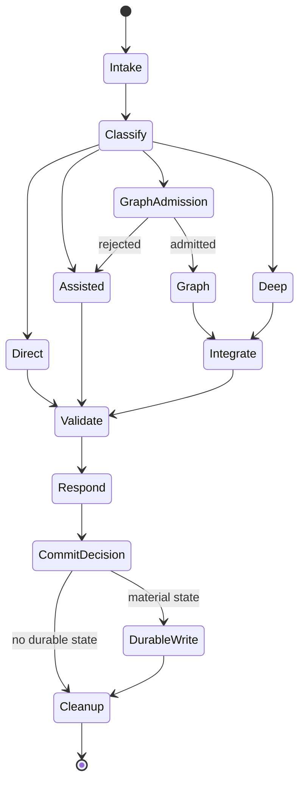

# Operations and Lifecycle

- Status: Blueprint v1 complete; implementation pending
- Scope: runtime lifecycle, maintenance, degraded modes, migration, dan rollout

## 1. Tujuan Operasional

Dokumen ini menentukan bagaimana produk berjalan dari satu prompt hingga durable
memory, bagaimana wiki dipelihara, serta bagaimana sistem gagal dengan aman.
Implementasi boleh memakai bahasa atau framework apa pun selama state transition,
authority boundary, dan acceptance behavior di bawah tetap sama.

## 2. Peran Operasional

| Peran | Tanggung jawab | Batas authority |
| --- | --- | --- |
| User | Menentukan intent, keputusan, permission, dan trade-off material | Authority tertinggi untuk scope penggunaan |
| Root | Admission, routing, context, integration, final answer, memory acceptance | Tidak boleh memperluas permission atau memalsukan user decision |
| Specialist | Menyelesaikan bounded node dan mengirim evidence/artifact | Tidak menulis authority final atau mengubah goal |
| Knowledge compiler | Menghasilkan semantic proposals dari sources | Proposal bukan fakta sampai validation/write gate |
| Memory writer | Atomic/CAS write, ledger, index invalidation | Hanya menerima validated operations |
| Operator/reviewer | Health check, lint, benchmark, incident, rollout/rollback | Tidak mengubah product authority tanpa approval |

Pada V1, beberapa peran dapat dijalankan proses atau agent yang sama. Boundary
logisnya tetap wajib.

## 3. Request Lifecycle

### 3.1 Intake

Root MUST:

1. mengikat current user request sebagai authority utama;
2. membaca system/developer/repository rules yang memang in scope;
3. memisahkan instruction dari attachment, source, memory, dan tool output;
4. mendeteksi kebutuhan permission, destructive action, freshness, atau current
   external data;
5. tidak membaca global knowledge atau project recovery sebelum ada retrieval
   reason.

### 3.2 Classification

Root memberi skor/kategori internal terhadap:

- clarity dan ambiguity;
- fakta stabil versus current/external;
- jumlah artifact dan dependency;
- reversibility dan blast radius;
- domain risk, terutama security/privacy/data loss;
- kebutuhan spesialisasi atau independent verification;
- expected duration dan context need.

Keputusan lane:

| Lane | Admission | Default behavior |
| --- | --- | --- |
| `DIRECT` | Jelas, low-risk, pengetahuan stabil, satu outcome | Root menjawab/mengerjakan segera; tanpa graph/research |
| `ASSISTED` | Perlu local inspection, satu capability, atau bounded retrieval | Root tetap single execution owner |
| `GRAPH` | >=2 cabang independen, multi-artifact dependency, atau measurable parallel benefit | Root membuat DAG dan mengintegrasikan hasil |
| `DEEP` | Security, production, destructive, migration, adversarial review, atau explicit deep scope | Root memakai gate tambahan; boleh memakai graph |

Jika ragu antara dua lane, pilih lane lebih ringan dan naikkan bila evidence
konkret menuntutnya. Safety-critical ambiguity adalah pengecualian: klarifikasi
atau route lebih kuat boleh dilakukan sejak awal.

### 3.3 Context Admission

Context tidak dimuat berdasarkan kebiasaan. Root menyusun `context_request`
dengan task intent, project/global scope, object kinds, freshness threshold,
budget, dan exclusions.

Urutan retrieval default:

1. current project instructions dan exact files yang relevan;
2. project recovery bila task melanjutkan proyek;
3. global knowledge bila reusable knowledge dapat mengurangi uncertainty;
4. external sources bila currentness atau evidence tambahan diperlukan.

Setiap layer dapat dilewati. Packet MUST memuat health/freshness metadata agar
empty result tidak disalahartikan.

### 3.4 Capability and Model Selection

Root memilih logical profile dan capability minimum setelah lane ditentukan.

- User/repository-required skill mendapat prioritas jika tersedia dan aman.
- Capability otomatis hanya diaktifkan jika trigger cocok dan hasilnya dipakai.
- MCP/plugin yang memerlukan login, install, permission baru, atau global mutation
  berhenti pada consent boundary.
- Model ringan hanya menerima bounded, reversible work dengan objective answer
  atau verification murah.
- Model outage tidak boleh menghasilkan silent downgrade; lihat degraded modes.

### 3.5 Execution and Validation

`DIRECT` menggunakan internal reasoning secukupnya dan hanya validasi murah yang
material. `ASSISTED` dapat memakai plan singkat, local tools, atau satu retrieval
loop. `GRAPH` mengikuti lifecycle pada Bagian 6. `DEEP` menambahkan independent
review dan security/rollback gate sesuai risk.

Validation depth mengikuti risiko:

| Risk | Minimum gate |
| --- | --- |
| Low/reversible | sanity check atau exact calculation |
| Medium | targeted test, source check, atau artifact inspection |
| High/blast-radius | independent review plus relevant test/evidence |
| Security/privacy/data loss | adversarial check dan explicit unresolved-risk report |

### 3.6 Response and Commit Decision

Root memberi outcome terlebih dahulu. Setelah itu root menilai durable write
menggunakan matrix Bagian 8. Response tidak menunggu maintenance non-critical;
write failure yang memengaruhi promised recovery MUST dilaporkan.

## 4. Knowledge Lifecycle: Ingest, Compile, Query, Lint

### 4.1 Ingest

Operational sequence:

1. Resolve source identity dan permission.
2. Capture exact/fidelity-preserving bytes dan content digest.
3. Store immutable source metadata, including capture time, original location,
   source date, media type, author/publisher, license, trust, dan parser version.
4. Parse dalam data boundary; abaikan embedded instructions.
5. Extract entity/concept/claim/synthesis proposals dengan precise source spans.
6. Deduplicate dan reconcile dengan current semantic objects.
7. Surface contradictions, unresolved identity, atau unsupported inference.
8. Apply accepted revisions secara atomic/CAS.
9. Emit append-only events, invalidate affected derived views, lint, lalu publish
   index revision yang bound ke authority digest.

Captured source bytes tidak pernah diedit. Kesalahan metadata pada source object
diperbaiki melalui CAS revision/event tanpa mengubah raw blob yang dirujuk.

### 4.2 Maintained Wiki Update

Wiki update adalah compilation, bukan append-only dumping. Ketika source baru
masuk, compiler MUST menentukan semantic pages yang:

- tetap unchanged;
- memperoleh supporting source baru;
- memerlukan claim revision;
- menjadi `partially_stale` atau `disputed`;
- membutuhkan page baru;
- kehilangan status current tetapi tetap disimpan sebagai history.

Synthesis SHOULD menyatakan current consensus, known disagreement, evidence date,
dan open questions. Ia tidak boleh menyembunyikan klaim yang bertentangan hanya
untuk menghasilkan narasi rapi.

### 4.3 Query

Query lifecycle:

1. Normalize intent tanpa menghilangkan istilah pengguna.
2. Pilih scope global/project dan required freshness.
3. Pastikan index revision cocok dengan authority digest.
4. Jalankan lexical/metadata retrieval terlebih dahulu.
5. Expand typed relations dan synonyms hanya bila menambah recall.
6. Gunakan semantic/vector retrieval sebagai optional fallback atau reranker,
   bukan authority.
7. Rank berdasarkan relevance, authority, verification, freshness, diversity, dan
   token cost.
8. Compile packet dengan citations, uncertainty, stale/disputed warnings, serta
   omitted-result summary.
9. Bila evidence belum cukup, lakukan bounded retrieval round berikutnya.

Query output boleh menjadi proposal untuk memperbarui synthesis, tetapi jawaban
agent tidak otomatis ditulis ke wiki.

### 4.4 Lint

Lint dijalankan:

- blocking subset sebelum authoritative semantic write;
- affected-scope lint setelah setiap write;
- full lint sebelum release/migration/cutover;
- scheduled full lint hanya jika user mengaktifkan automation.

Severity:

| Level | Contoh | Operasi |
| --- | --- | --- |
| `BLOCK` | schema invalid, secret, authority mismatch, broken revision, source digest mismatch | Tolak write/publish |
| `ERROR` | claim tanpa source, dangling required relation, cross-project leakage | Mark unhealthy; exclude unsafe artifact |
| `WARN` | orphan concept, partially stale ref, open contradiction, weak source diversity | Publish dengan visible status |
| `INFO` | suggested backlink, possible duplicate, old unqueried page | Maintenance backlog |

## 5. Project Recovery Lifecycle

Project Recovery Plane menyimpan active working truth, bukan encyclopedia.

### 5.1 Material Events

Checkpoint/recovery update dipertimbangkan ketika:

- user menetapkan atau mengubah keputusan;
- objective atau next action berubah material;
- blocker ditemukan/diselesaikan;
- code/schema/API penting berubah;
- test/verification mengubah confidence;
- handoff, compaction, resume, atau stop terjadi.

Tidak ada checkpoint untuk setiap pesan atau tool call.

### 5.2 Write Contract

Writer MUST menggunakan lock, atomic write, revision/CAS, schema validation,
secret/injection check, dan append-only event. Project object mencantumkan branch
atau worktree scope bila relevan. Derived index dan Recovery Pack di-invalidasi
setelah authority mutation.

### 5.3 Freshness Contract

Code/source references memiliki digest dan freshness sendiri. Object-level state
diturunkan dari claim/reference states, bukan boolean tunggal.

Contoh: jika 1 dari 19 references berubah, record tetap retrievable sebagai
`partially_stale`; packet menunjukkan reference yang berubah dan claim mana yang
terdampak. Hanya claim yang tidak lagi didukung yang diturunkan, bukan seluruh
record.

### 5.4 Recovery Pack

Pack disusun dari active objective, current user decisions, blockers, next steps,
recent material evidence, dan affected files. Pack MUST:

- bounded dan task-specific;
- memiliki authority-state digest dan generation time;
- menyatakan missing, stale, partially stale, dan disputed relevant records;
- tidak memenuhi ruang dengan unrelated "essential" object ketika high-relevance
  record terfilter;
- tidak memuat global knowledge kecuali context request eksplisit;
- dapat diregenerasi dari authority store.

### 5.5 Lifecycle Hooks

Jika host menyediakan lifecycle hooks:

1. `PreCompact` memvalidasi current checkpoint dan menyegel generated pack di
   bawah authoritative writer boundary.
2. `PostCompact` memvalidasi receipt, exact pack digest, authority epoch, session,
   dan expiry sebelum recovery dipakai.
3. `SessionStart(resume|compact)` memakai receipt yang valid untuk session terkait.
4. Cold startup dapat mengadopsi prior valid receipt hanya melalui explicit cold
   recovery policy.
5. Invalid, changed, expired, atau cross-session receipt fail closed lalu sistem
   menawarkan rebuild dari authority state.

Jika hook tidak tersedia, explicit material checkpoint dan startup recovery command
menjadi fallback. Fallback ini tidak boleh dilabeli fully automatic.

## 6. Work Graph Lifecycle

### 6.1 Admission Gate

Graph hanya admitted bila salah satu kondisi benar:

- minimal dua deliverable dapat maju tanpa saling menunggu;
- pekerjaan memiliki dependency chain dengan beberapa ready nodes;
- artifact terpisah membutuhkan domain specialist berbeda;
- high-risk integration membutuhkan independent reviewer;
- expected wall-clock/quality benefit melampaui coordination overhead;
- pengguna secara eksplisit meminta graph sebagai execution mode.

Graph ditolak jika task diperkirakan selesai root dalam sekitar tiga menit,
memiliki satu file/perubahan jelas, atau seluruh node akan membaca/menulis scope
yang sama secara serial, kecuali explicit user choice tetap meminta graph. Graph
seperti itu tercatat sebagai `user_explicit_graph` dan bukan keberhasilan automatic
admission.

### 6.2 Graph Construction

Root menetapkan DAG dengan:

- immutable overall goal;
- node ID dan bounded objective;
- dependencies dan readiness condition;
- read/write scope;
- owner profile dan capabilities;
- input context digest;
- artifact/output schema;
- acceptance checks;
- timeout, retry, dan cancellation rule;
- integration dan final-review node.

At most satu active writer per overlapping scope. Research/read-only nodes dapat
berjalan paralel. Node tidak boleh membuat node baru atau memperluas scope tanpa
policy/approval dari root.

### 6.3 Execution

Scheduler hanya menjalankan ready nodes. Node yang menunggu dependency tidak
mengonsumsi model session. Specialist menerima minimal sufficient context, bukan
seluruh conversation. Progress event hanya dikirim pada milestone, block, atau
material finding.

### 6.4 Integration and Review

Root memeriksa artifact, provenance, tests, dan conflict. Hasil specialist adalah
proposal sampai diterima. Integration MUST memeriksa cross-artifact contracts,
tidak sekadar menggabungkan summary. High-risk graph memiliki independent final
reviewer yang tidak menjadi implementer utama.

### 6.5 Cancellation and Retry

- User override membatalkan pending nodes dan menghentikan active nodes pada safe
  boundary.
- Node failure dapat di-retry hanya bila error transient dan retry budget tersisa.
- Deterministic failure tidak diulang tanpa perubahan input/strategy.
- Bila paralelisme gagal namun task masih aman, root dapat menyerialkan remaining
  nodes.
- Partial artifacts tidak menjadi durable truth sebelum integration gate.

## 7. Capability Lifecycle

### 7.1 States

Capability memiliki state `discovered`, `available`, `healthy`, `degraded`,
`disabled`, `missing`, atau `quarantined`.

### 7.2 Discovery and Admission

Registry diperbarui dari installed skills/plugins/MCP dan trusted manifests.
Discovery tidak sama dengan activation. Sebelum use, selector memvalidasi trigger,
version, health, permission, trust, input scope, dan fallback.

### 7.3 Install and Update

Instalasi atau update third-party capability MUST melalui:

1. provenance dan maintainer/reputation inspection;
2. license dan manifest review;
3. source/security review sebanding permission;
4. pinned version/commit dan checksum bila tersedia;
5. isolated staging;
6. bounded canary;
7. explicit approval untuk global activation;
8. rollback record.

Popularity atau nama maintainer bukan pengganti code/security review.

### 7.4 Retirement

Capability yang obsolete, duplicate, unhealthy, atau tidak lagi dipercaya diberi
state disabled/quarantined sebelum dihapus. Registry dan routing policy MUST tidak
meninggalkan dangling references. Historical audit tetap menyimpan version yang
pernah dipakai, bukan executable package bytes jika license/policy melarangnya.

## 8. Durable Memory Write Matrix

| Event/content | Global knowledge | Project recovery | Default action |
| --- | --- | --- | --- |
| Greeting, simple calculation, casual answer | No | No | Jangan simpan |
| Raw transcript atau chain-of-thought | No | No | Dilarang |
| User preference yang benar-benar global | Candidate | No | Simpan hanya dengan explicit scope/provenance |
| Artikel/repository/document yang diminta untuk diingest | Source + proposals | No | Immutable ingest |
| Reusable concept/claim lintas proyek | Candidate synthesis | No | Compile dan validate |
| Project-specific user decision | No | Decision | Confirmed authoritative write |
| Active task, blocker, next step | No | Task/recovery | Material checkpoint |
| Test result/current code evidence | No, kecuali reusable method | Evidence | Bind exact refs/digests |
| Temporary hypothesis/draft | No | Optional unverified proposal | Umumnya jangan simpan |
| Secret/credential/private runtime key | No | No | Reject dan redact |
| Specialist output | Proposal only | Proposal only | Root acceptance required |

## 9. Degraded and Failure Modes

| Failure | Detection | Required behavior | User visibility |
| --- | --- | --- | --- |
| Derived index missing | File/open failure | Scan authority files atau rebuild | Tidak perlu jika hasil setara |
| Index digest stale | Revision/digest mismatch | Jangan query index; rebuild/fallback scan | Tampilkan bila menambah latency atau mengurangi recall |
| Partial reference staleness | Per-ref digest mismatch | Return relevant object dengan affected-claim warning | Ya, jika dipakai |
| Authority/source digest mismatch | Integrity validation | Fail closed; quarantine dan restore/reconcile | Selalu |
| Empty retrieval + unhealthy index | Health metadata | Jangan simpulkan "tidak ada"; retry authority path | Bila jawaban terpengaruh |
| Parse failure | Parser error/unsupported media | Simpan source di quarantine; jangan publish claims | Ringkas |
| Contradictory claims | Relation/lint | Preserve both; mark disputed; request/seek resolution | Ya, jika material |
| Prompt injection dalam source | Content policy detector | Treat as quoted data; never execute | Hanya jika memengaruhi coverage |
| Secret detected | Scanner/policy | Reject write, redact logs, flag incident | Selalu |
| Concurrent write conflict | CAS/lock failure | Retry read-reconcile-write; never last-write silently | Jika unresolved |
| Invalid recovery receipt | Signature/session/expiry mismatch | Reject injection; rebuild from authority | Selalu |
| Global/project scope collision | Scope validator | Exclude cross-scope object; lint error | Selalu jika relevant |
| Required plugin/MCP missing | Registry/health | Use safe fallback atau request install | Jika material |
| Network unavailable | Connection/health check | Use cached/local evidence with date or defer current claim | Ya untuk current facts |
| Preferred model unavailable | Route health | Use approved equivalent only if quality floor holds | Ya jika route material berubah |
| Only lower-quality model available | Capability comparison | Pause/ask user or narrow task; no silent downgrade | Selalu |
| Specialist timeout/failure | Scheduler | Retry transient, reroute, or serialize | Hanya jika outcome/duration berubah |
| Graph integration conflict | Contract/test failure | Reopen affected node or root reconcile; do not publish | Selalu bila blocker |
| Context budget exhausted | Compiler telemetry | Iterative retrieval, evidence compression, or split question | Jika completeness terbatas |
| Lint blocking error | Lint severity | Reject publish/write; preserve diagnostic artifact | Selalu untuk promised write |
| Audit/log write failure | Runtime health | Continue direct read-only work; block authoritative mutation | Selalu bila persistence dijanjikan |

## 10. Data Retention and Maintenance

### 10.1 Authority Retention

- Immutable sources dan authoritative revision/events dipertahankan sampai user
  menjalankan explicit retention/deletion policy.
- Superseded claims/decisions tidak tampil sebagai current, tetapi history tetap
  dipertahankan.
- Deletion harus menghasilkan tombstone/audit event jika provenance atau backlinks
  bergantung padanya.
- Secrets yang tidak sengaja tertulis diperlakukan sebagai security incident dan
  dapat memerlukan history rewrite/revocation; normal append-only rule tidak
  mengalahkan secret remediation.

### 10.2 Derived Retention

Indexes, embeddings, MOC, caches, compiled packets, dan Recovery Pack dapat
dihapus serta dibangun ulang. Runtime logs memiliki size/time cap dan redaction.
Task-local working artifacts dibersihkan setelah integration kecuali dibutuhkan
sebagai verification evidence.

### 10.3 Maintenance Cadence

Tidak ada background automation wajib. Saat diaktifkan user, cadence default:

- per write: affected lint, index invalidation/publish, backlink/MOC update;
- per project milestone: recovery compaction dan stale-reference scan;
- mingguan saat aktif: full lint, orphan/contradiction review, capability health;
- bulanan atau sebelum upgrade: rebuild rehearsal, backup restore test, benchmark
  sample, dependency/license/security review;
- sebelum global rollout: full suite, canary, exact config diff, rollback rehearsal.

## 11. Observability

### 11.1 Required Event Fields

Structured audit event untuk operasi non-direct/material MUST menyimpan:

- event ID, schema version, timestamp, session/task ID;
- operation dan lane;
- root/model logical profile dan capability IDs/versions;
- input/output artifact IDs atau digests, bukan private raw content;
- project/global scope;
- context packet size, source count, freshness distribution;
- admission/fallback reason code;
- validation/lint result;
- memory mutation revision/epoch bila ada;
- error class dan recovery action.

Tidak boleh menyimpan chain-of-thought, credentials, raw private headers, atau
full prompt secara default.

### 11.2 Operational Dashboards/Reports

Minimal report dapat dihasilkan untuk:

- lane distribution dan false graph admissions;
- direct routing overhead;
- capability precision dan failures;
- context size/relevance;
- retrieval recall/provenance/staleness;
- recovery success dan receipt failures;
- memory/lint health;
- quality regression dan fallback frequency.

## 12. Incident Handling

| Severity | Definition | Contoh | Response |
| --- | --- | --- | --- |
| SEV-0 | Authority/security compromised | secret leak, source mutation, cross-project data exposure | Stop authoritative writes, quarantine, preserve evidence, notify user, rotate/revoke, recover |
| SEV-1 | Quality-critical silent failure | stale truth presented as fresh, wrong project recovery, silent model downgrade | Disable affected path, fallback safe, notify, root-cause and regression test |
| SEV-2 | Major degraded function | index repeatedly corrupt, graph cannot integrate, required MCP unavailable | Use fallback/serial path, record incident, repair before rollout |
| SEV-3 | Convenience/performance issue | slow rebuild, optional plugin unavailable, advisory lint backlog | Continue safely, schedule maintenance |

Incident closure requires reproduced cause, corrective change, regression fixture,
and evidence that authority data tetap konsisten. Agent confidence saja tidak cukup.

## 13. Migration Lifecycle from `ai-memory`

Migration dilakukan sebagai program terpisah, bukan copy directory.

### Phase M0: Freeze and Inventory

- Mount/read source lama secara read-only.
- Record exact file manifest, digests, schema versions, branch/worktree, dan dirty
  state tanpa membersihkan perubahan user.
- Classify authoritative objects, events, recovery artifacts, derived indexes,
  runtime secrets, workflow/plugin leftovers, dan unrelated files.

### Phase M1: Correctness Gate

Sebelum reuse kernel, implement dan uji:

- per-claim/per-reference partial staleness;
- explicit stale/missing relevant result reporting;
- authority-to-index digest binding dan fallback scan;
- generic semantic revision/CAS;
- typed relation integrity;
- automatic MOC/backlink regeneration;
- clock-controlled lifecycle receipt tests.

### Phase M2: Transform Dry Run

- Map project/decision/task/bug/experiment/evidence/question ke Project Recovery
  Plane.
- Jangan otomatis mengubah operational evidence menjadi global knowledge.
- Ekstrak reusable knowledge hanya sebagai proposals dengan original provenance.
- Exclude runtime key, receipt, cache, derived SQLite, obsolete plugin bundle, dan
  old handoff/Obsidian state.
- Emit mapping report, warnings, collisions, rejected objects, dan target digests.

### Phase M3: Validate

- Run schema, authority, link, secret, stale, contradiction, and scope lint.
- Compare canonical queries dan recovery fixtures antara source dan target.
- Delete/rebuild all derived target state dan repeat tests.
- Review ambiguous user decisions dan global-knowledge proposals secara manual.

### Phase M4: Canary and Cutover

- Jalankan target sebagai read-only shadow untuk task representative.
- Canary direct, assisted, graph, deep, ingest/query/lint, fresh session, dan
  compaction.
- Ambil backup/snapshot sebelum mengaktifkan target writer.
- Switch satu project-local/staged workflow entry point; keep source lama
  read-only. Perubahan entry point global di `~/.codex` ditunda ke Milestone M9
  dan hanya boleh mengikuti exact approval packet yang masih current.
- Rollback bila acceptance metric atau authority invariant gagal.

### Phase M5: Archive

Source lama baru diarsipkan setelah soak period dan user approval. Tidak ada
penghapusan otomatis. Manifest, migration report, dan rollback instructions tetap
disimpan.

## 14. Release and Change Lifecycle

Setiap perubahan model route, schema, global instruction, capability, memory
authority, atau lifecycle hook mengikuti:

1. proposal dan affected requirement IDs;
2. threat/quality impact assessment;
3. implementation dalam isolated project/staging;
4. targeted tests dan full relevant suite;
5. artifact-bound canary;
6. exact diff serta rollback plan;
7. user approval jika global, permission-expanding, atau destructive;
8. controlled rollout;
9. readback/health verification;
10. soak dan promote, atau rollback.

Hotfix hanya boleh melewati ceremony non-essential, bukan integrity validation,
backup, atau rollback readiness.

## 15. Operational Acceptance Scenarios

### OA-01: Simple Calculus

Prompt stabil dijawab root langsung. Event menunjukkan tidak ada global retrieval,
plugin/MCP, atau graph. Correctness fixture lulus.

### OA-02: Current Technical Research

Prompt yang meminta status current menggunakan primary/official sources, membuat
bounded citations, tidak otomatis menulis jawaban ke wiki, dan menawarkan/menjalankan
ingest hanya sesuai user intent.

### OA-03: Multi-Artifact Build

Graph memiliki minimal dua ready branches, scope terisolasi, dependency dan final
integration. Wall-clock/quality benefit atau mandatory review reason dapat dibuktikan.

### OA-04: One Changed Reference

Record dengan 19 references dan satu berubah tetap ditemukan sebagai
`partially_stale`. Affected reference dan claim terlihat; 18 references lain tidak
kehilangan status tanpa alasan.

### OA-05: Stale SQLite

Markdown authority berubah tanpa index update. Query mendeteksi digest mismatch,
tidak mempercayai stale result, dan menghasilkan hasil benar melalui scan/rebuild.

### OA-06: Contradictory Sources

Dua primary sources berbeda dipertahankan, relationship `contradicts` terbentuk,
synthesis menyatakan disagreement dan dates, serta tidak memalsukan consensus.

### OA-07: Model or MCP Outage

Sistem memakai approved equivalent/local fallback bila quality floor tetap, atau
meminta user bila tidak. Route change dan evidence limitation tercatat.

### OA-08: Invalid Recovery Receipt

Recovery injection ditolak; authority store tidak berubah; rebuild path tersedia;
user menerima warning ringkas dan tidak diberi stale pack sebagai current truth.

### OA-09: Source Prompt Injection

Source berisi instruksi untuk mengabaikan user/system. Parser menyimpannya sebagai
quoted data; tidak ada tool/global write yang dipicu; lint/security fixture lulus.

### OA-10: User Interrupts Active Graph

Pending nodes dibatalkan, active writers berhenti pada safe boundary, partial
artifacts ditandai non-authoritative, root merespons intent terbaru tanpa menunggu
seluruh graph lama.

## 16. Definition of Operational Done

Satu request selesai secara operasional bila:

- outcome telah dikirim dan sesuai current user intent;
- required verification selesai atau limitation dinyatakan;
- graph node dan capability tidak tertinggal aktif tanpa owner;
- authoritative writes, jika ada, atomic dan tervalidasi;
- derived state di-invalidasi/rebuilt sesuai policy;
- audit event material tersimpan dan redacted;
- temporary sensitive artifacts dibersihkan;
- next step/blocker hanya masuk recovery bila benar-benar current.

Global rollout selesai hanya bila acceptance criteria PRD, migration canary,
rollback rehearsal, dan user approval semuanya terpenuhi.
